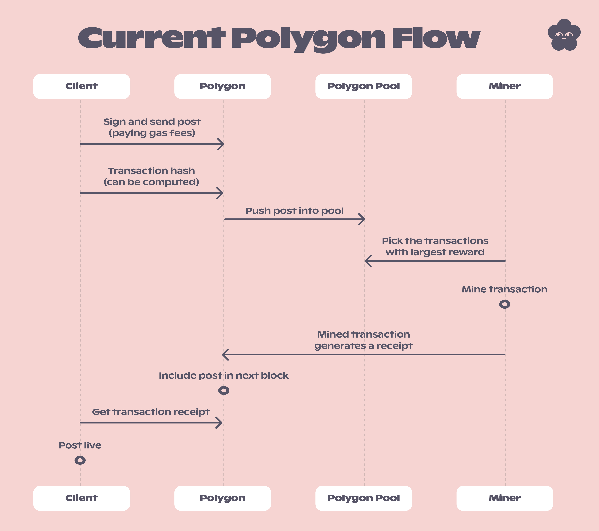
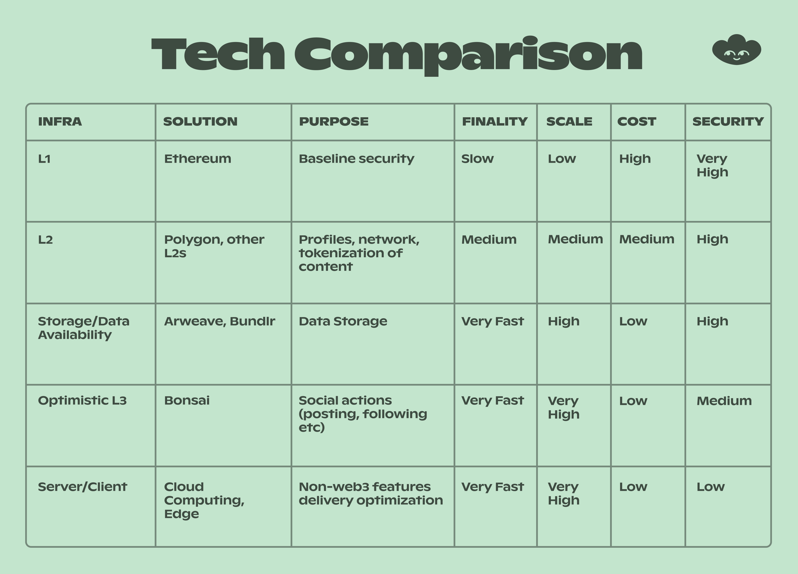
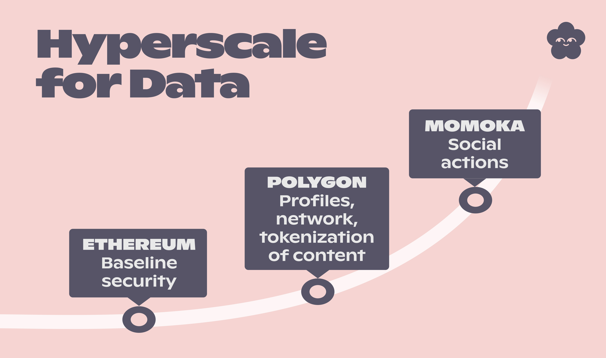
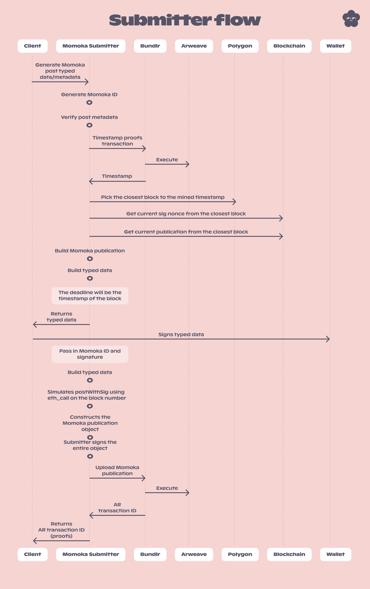
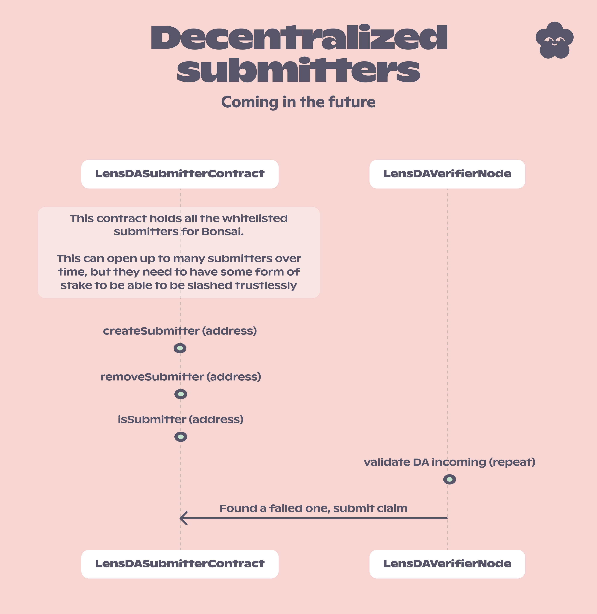
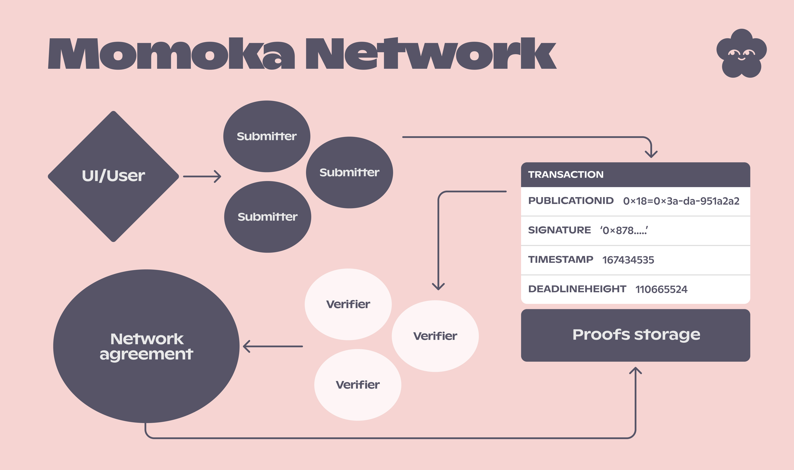

# Momoka


## Disclaimer

We would like to emphasize that this project is currently in its beta phase and incorporates new, innovative technology. As with any cutting-edge solution, there may be potential challenges or undiscovered issues that could arise during its initial stages. We are committed to continually refining and improving our offering, and we appreciate your understanding and patience as we work diligently to perfect this technology. Please feel free to provide feedback or report any issues, as your input is invaluable in helping us enhance the user experience and overall functionality of our project.

# Momoka explorer

You can explore all momoka transactions on the explorer [here](https://momoka.lens.xyz). It is also open-source https://github.com/lens-protocol/momoka-explorer.


# Momoka Verifier

The Momoka Verifier enables you to operate a trustless verifier node that validates LENS DA publications in real-time. Additionally, it can serve as an indexer, allowing you to stream and index the data yourself. This open-source solution relies exclusively on software that you can run independently, without any dependency on LENS. This ensures that even if LENS were to cease operation, you would retain access to your content, maintain proof of ownership, and continue to utilize it, all thanks to a decentralized data availability storage layer.

For information on how to run this software, please refer to the [Technical code and how to run a verifier](#technical-code-and-how-to-run-a-verifier) section.

## What is Momoka technical definition?

Momoka, a term we've due to lens brand, refers to an Optimistic L3 - a hybrid by taking best from both - Optimistic Rollups and L3 technologies. We've chosen this approach for several reasons:

- Optimistic Rollup is a technique that processes transactions off-chain for enhanced scalability and reduced fees. It typically compresses these transactions back to the main chain, but we've excluded this final step in our implementation.
- L3, while having various definitions, generally involves technology built on top of Layer 2 (L2). Despite some considering Polygon a combination of side-chain and L2, we utilize the Polygon EVM chain to enable transaction proofs, improving the user experience (UX/UI) and overall experience for LENS users. This is why we designate it as L3.

We describe Momoka long form name as an "Optimistic Hybrid-settlement L3" because, in most cases, settlement refers to both storage and verification. However, in this instance, the storage layer is provided by the Data Availability (DA) provider, and the settlement, or proof verification, is conducted using the Polygon chain.

As we continue to refine this technology, the technical name may evolve, but we wanted to clarify the rationale behind the current terminology.

## What is DA?

DA stands for Data Availability. It refers to the concept of storing data in a decentralized availability layer, which is more cost-effective than storing it on an EVM chain. The DA has no latency, meaning the data is produced and queryable instantly, in contrast to IPFS and EVM chains, which always have latency until they are considered complete. We utilize Arweave and Bundlr for this purpose. Arweave is a decentralized, permanent storage network with over 100 nodes in operation (as writing this documentation); it is being increasingly adopted by various NFT projects. Bundlr enhances Arweave's scalability while providing DA guarantees, enabling the use of EVM wallets to save DA logic and serving as a tool to rapidly push data to Arweave. DA can be used to store actions like posts, comments, mirrors, and more; initially, we are focusing on publications. The goal is to keep the DA layer affordable and scalable while still verifying transactions on Polygon using EVM simulations. DA requires a one-time payment for data storage and is backed by mathematical and hardware history guarantees.

Using this software, you can verify that a particular action would have been executed on-chain. The approach involves performing the same signing actions as you would on an EVM chain, but without actually sending the transaction (which consumes gas to store in the EVM state). Instead, you create a DA standard and save it on a DA layer, complete with proofs and all the required information. This enables ANYONE to cross-check the data, providing 100% proof that the action must have been performed by someone capable of creating the transaction signature and submitting it. This can be demonstrated by simulating the transaction. This approach allows LENS to scale while maintaining the core values of "ownership" and "trust" provided by the blockchain.

## Why do we need to use DA?

EVM can store state indefinitely, but at a cost; blockchains were designed for trustless transactional systems. EVM is secured by the network and mined into the chain; the data on-chain is immutable and verifiable at any time, ensuring trust. However, storing data on-chain is expensive, and EVM machines can only process a limited number of transactions per block based on maximum gas limits. Polygon is a shared block space; and at the moment has challenges scaling beyond 50-100 TPS. With 2-second block times, some latency is unavoidable, and max gas limits per block make scaling challenging, if not impossible. For context, Twitter experiences peak rates of 25,000 TPS; while LENS may not require this level of capacity yet, scalability is a critical consideration. This is where DA layers come in; they offer a more affordable solution for storing data with a one-time payment, backed by mathematical guarantees and a history of decreasing hardware costs over time. Moreover, these DA layers are decentralized, preserving this aspect of the system. DA enables scalability beyond 25,000 TPS, and even more; if we aim to revolutionize the world of core social ownership, we must be able to scale accordingly.

## What are transactions on EVM machines?

A transaction on an EVM machine alters some form of state; it is signed by the wallet's private key and then transmitted to the network. The network verifies the signature and executes the transaction, which contains logic that can either succeed or revert. If the transaction reverts, it is not included in the new block; if it succeeds, it is incorporated into the new block and confirmed by other miners. Miners are incentivized to perform these confirmations. This process ensures that transactions cannot be "faked," as they require a valid signature from a trusted key. Furthermore, a transaction can only succeed or revert—nothing more, nothing less. As the EVM progresses block by block and updates the state each time, it raises the question: what if you performed all steps of a transaction, except actually sending it, for actions that don't involve transferring funds or trustless executions?

## How can DA and EVM work together?

LENS is deployed on Polygon, an EVM-based platform. All actions—such as posts, comments, mirrors, follows, and collects are transactions that are built, signed, and sent to be stored on the EVM machine. In the new system, transactions are still built and require a signature from a wallet that would pass the state on-chain, but they are not actually sent. Instead, the transaction signature and typed data are used to create DA metadata, which is then transmitted to a DA layer containing information such as block number, signed typed data, transaction signature, and other crucial details. This data is structured in a way that can be fully verified with just having an archive node.

EVM machines function as large state machines. The EVM JSON-RPC methods allow you to simulate transactions using `eth_call`, determining the outcome of a transaction without actually sending it. You can specify a block number to run the simulation and use the signed typed data transaction with the typed data. This can be done with every `withSig` method on the LENS contracts. With just a Polygon node, anyone can verify that the data on the DA layer is accurate and would have been valid at that point in time. Since the typed data contains expiry times and nonces, it can be proven in a secure manner and can not be submitted by anyone else, edge cases around this are huge reorg ranges which we cover below.

The advantage of this approach is that the data is stored on a decentralized layer, meaning that no centralized entity controls the content. Users retain ownership of their publications, and if any part of LENS were to disappear, all the data would remain verifiable, accessible, and usable by anyone. This demonstrates the power of decentralization, ensuring that users' data cannot be taken away from them.

## What does this mean?

This approach allows LENS to scale to a lot higher TPS, which is currently unattainable with an EVM chain, while also providing a more cost-effective solution. This can be achieved without compromising the core ownership of the social graph, and the indexing process remains familiar for app developers. Using this system is optional; those who prefer can continue to store everything on Polygon. However, if a publication doesn't require the power of a trustless execution layer, there's no need to use the EVM state.

## Momoka vs polygon side by side

Here are diagrams that show how a transaction would look like on Polygon versus a transaction using the DA layer. These diagrams are meant to provide a simplified high-level overview of how the transactions work, while more detailed information is provided below with all the necessary technical details.

### Polygon



### Momoka


## Comparison



The reason momoka security is medium and not high is that in theory a submitter could refuse to process transactions from certain users even though validators could do this as well as we only have 1 for now the fix is more. As we increase more submitters this comes down, also the bad submitters could in theory flood the system without any slashing mechanism. This is a problem that will be solved in the future.

We'd like to emphasize that while using Momoka, you can enjoy the benefits of finality, scalability, and cost-effectiveness. However, there is a slight tradeoff in terms of security, especially until we have many verifiers and submitters in the network. This is similar to what would happen to Ethereum's security if it lost all its validators. It's a tradeoff we're willing to make for now during our beta phase. We firmly believe that the advantages of the DA outweigh the disadvantages, even though we cannot start fully decentralized. Nevertheless, we're committed to working towards that goal with momoka.

## Hyperscale



## Momoka Submitters

To maintain trust, submitters must be held accountable for their actions and face potential penalties for misconduct. Initially, the submitter whitelist will consist of a single address owned by LENS. As the approach is proven, the system can be expanded to allow anyone to become a submitter, with incentives for good behavior and penalties for bad actors. If submitters have nothing to lose, they could flood the system with invalid submissions, overwhelming verifiers and causing delays. During the beta phase, LENS will be responsible for correcting any errors, with bug bounties planned for the post-beta period. Ultimately, the goal is to have multiple submitters contributing to the system. It's important to note that certain errors, such as `UNKNOWN`, `CAN_NOT_CONNECT_TO_BUNDLR`, `BLOCK_CANT_BE_READ_FROM_NODE`, `DATA_CANT_BE_READ_FROM_NODE`, and `SIMULATION_NODE_COULD_NOT_RUN`, `POTENTIAL_REORG` are related to third-party software issues and not considered critical verifier errors. The verifier will retry these errors later to see if they still pass. Over time, the entire system could become decentralized. For now, this beta approach represents the first attempt at scaling using a hybrid module model.

### Momoka Submitters' responsibilities

Submitters are responsible for validating, building up DA metadata, and submitting it to Arweave/Bundlr. After generating proofs with the DA submission, the data is uploaded to Arweave via Bundlr, with an instantaneous response. The submitter must provide proofs that anyone can contest. Verifier software listens for DA publications sent from whitelisted submitter addresses and verifies their validity.

### Momoka Submitter flow

The flow diagram shows the submitter flows in detail; the first submitter will be within the LENS API to allow for easy integration for all.



### Momoka Future of decentralised submitters

This is a rough look at how this could work in the future in a trustless manner. This is not the final solution but a rough idea of how it could work on a very high-level vision.



## Momoka Verifiers

Verifiers are tasked with monitoring DA publications from submitters and confirming their validity. They must follow specific criteria when evaluating incoming publications, with the primary goal of ensuring the submitter is truthful. Anyone can run a verifier using open-source software and a few commands. The verifier utilizes LevelDB for quick storage of passed results. The code has the capability to use a forked archive node with Foundry's `anvil` for local machine execution. However, for optimal speed, it is recommended to use an archive node directly (Alchemy is suggested but not required). All that's needed to run a verifier is an archive node.

## Momoka Current limitations with DA publications

- DA publications must use the `RevertCollectModule` and no `ReferenceModule`. This will be addressed in a future release.
- For now, DA comments can only be added to other DA publications; they cannot be mixed. This limitation will be explored after the v1 launch.
- DA mirrors can only mirror DA publications, not Polygon publications. This issue will be addressed post-v1 launch.
- While it's not possible to prove DA publications on other DA publications on Polygon (as they are not on-chain), it's still possible to verify the signatures and transactions as valid. However, simulations cannot be executed in this scenario.
- When verifying a submission, the pointer is checked as well. Only the first pointer is checked, not unlimited pointers, as the other verifications would have been done by the verifier.

## Compatibility with signature-free transactions

A top-class UX is essential for LENS users. DA publications work with the dispatcher, which can post, mirror, or comment on users' behalf. If enabled, this will pass state checks. The LENS contract logic states that if the dispatcher signs on behalf of the user, it will result in a valid transaction. Users who don't want to trust the dispatcher can still sign the typed data with their wallet and submit it through the submitter. This process is similar to the current flow, but the transaction is sent to a submitter instead of a Polygon node.

## Gasless transactions

DA operations don't require gas, making them free to use. The app still needs to upload the contentURI to a resolvable location, the submitter pays for storage of DA metadata on Arweave/Bundlr, which is significantly cheaper than EVM gas prices (up to 1000x cheaper).

## Timestamp proofs for picking the block number

You might be concerned that a submitter could deceive about which block to submit on, but that's where Bundlr timestamp proofs come into play. In addition, each signature has a deadline that corresponds to the timestamp of an already mined block, rendering the signature invalid if sent. Bundlr enables you to request a timestamp proof that returns the current timestamp while storing it, allowing anyone to verify that the time was generated by them. This becomes our source of truth for determining the appropriate block number to use; we should use the block number closest to the timestamp generated by Bundlr. It's important to note that latency will inevitably occur due to node software, so if it selects a block number and, upon verification, it is one behind, we consider this an acceptable threshold.

## Handling reorgs

A reorg on the EVM chain occurs when the blockchain structure changes, often due to a consensus failure or attack. This can lead to previously confirmed transactions becoming unconfirmed, and vice versa. It has significant security implications, making it crucial to be aware of the potential for reorgs and take measures to mitigate their impact. Developers at Polygon and other organizations working on EVM software are striving to reduce the frequency and depth of reorgs, making the issue less concerning. As a general precaution, waiting before considering a transaction final, much like how centralized exchanges operate, is the safest approach - the longer the wait, the lower the risk of a reorg affecting the transaction. In Momoka's first beta version, users cannot mix DA actions with EVM on-chain actions, which was implemented intentionally to simplify handling reorgs.

Currently, the validator doesn't recheck proofs once they are validated, as its primary objective is to validate as quickly as possible for the initial proof. However, as we start integrating DA actions with EVM on-chain actions, we will need to incorporate reorg handling and enable the verifier to recheck intelligently.

For now, any reorg handling or rechecking must be performed outside of the validator software. For example, the LENS API also monitors reorgs and re-validates proofs if a reorg affects any DA actions.

If a transaction is part of a reorg and ends up in a different block or not included at all, the proofs should be re-validated using the new blockchain state, ensuring their validity despite the reorg.

As we are not mixing and matching actions we remove a lot of the issues but not all, the edge cases that could cause issues are situations where for example someone sets a dispatcher and then straight away performs an DA action that has the dispatcher sign on their behalf, and then a reorg follows. If the transaction which adds the dispatcher to the profile is not resubmitted or is resubmitted at a higher block number, the proofs would fail. In that case, rerunning the proofs would return a `POTENTIAL_REORG` error which is not "bad" in terms of a submitter doing wrong as they could not of predicted it, you can handle this then as needed. Once we start integrating the cross actions, we will handle such cases within the validator.

A reorg of the blockchain can potentially affect the signing expiry of transactions. In the unlikely scenario of a severe reorg where time goes backwards on a block, it's conceivable that a transaction could be submitted to the chain that you never intended to. While this is a highly improbable edge case, it's essential to be aware of the possibility. As we embark on building the on-chain publications and DA publication connection, we'll delve deeper into these complex topics.

## Future of Momoka

As we said above this is very much in BETA and as we learn, shape and grow the solution we envision the architecture will end up looking something like this, with decentralised submitters and verifiers.



## DA publication metadata

Momoka verifier supports both v1 and v2 publications.
We will show you a few examples of the `DA` metadata and then explain each field.

### Post v1 example

```js
{
  signature:'0x87866d620636f62aa3930d8c48be37dac77f96f30a9e06748491934fef75e7884a193d59fc486da3ea35f991bbd37a04ea4997e47f191d626ad2b601e3cc57a71c',
  dataAvailabilityId: '951a2a24-46fd-4306-8c31-46a8318a905e',
  type: MomokaActionTypes.POST_CREATED,
  timestampProofs: {
    type: MomokaProvider.BUNDLR,
    hashPrefix: '1',
    response: {
      id: 'f7_YMkEqiALN9PCtK5LXxFDlc3EEi20-DWl57KxDMbw',
      timestamp: 1674736509185,
      version: '1.0.0',
      public:
        'sq9JbppKLlAKtQwalfX5DagnGMlTirditXk7y4jgoeA7DEM0Z6cVPE5xMQ9kz_T9VppP6BFHtHyZCZODercEVWipzkr36tfQkR5EDGUQyLivdxUzbWgVkzw7D27PJEa4cd1Uy6r18rYLqERgbRvAZph5YJZmpSJk7r3MwnQquuktjvSpfCLFwSxP1w879-ss_JalM9ICzRi38henONio8gll6GV9-omrWwRMZer_15bspCK5txCwpY137nfKwKD5YBAuzxxcj424M7zlSHlsafBwaRwFbf8gHtW03iJER4lR4GxeY0WvnYaB3KDISHQp53a9nlbmiWO5WcHHYsR83OT2eJ0Pl3RWA-_imk_SNwGQTCjmA6tf_UVwL8HzYS2iyuu85b7iYK9ZQoh8nqbNC6qibICE4h9Fe3bN7AgitIe9XzCTOXDfMr4ahjC8kkqJ1z4zNAI6-Leei_Mgd8JtZh2vqFNZhXK0lSadFl_9Oh3AET7tUds2E7s-6zpRPd9oBZu6-kNuHDRJ6TQhZSwJ9ZO5HYsccb_G_1so72aXJymR9ggJgWr4J3bawAYYnqmvmzGklYOlE_5HVnMxf-UxpT7ztdsHbc9QEH6W2bzwxbpjTczEZs3JCCB3c-NewNHsj9PYM3b5tTlTNP9kNAwPZHWpt11t79LuNkNGt9LfOek',
      signature:
        'Requv25_byuhK_k0JPz2tjKLhmqUv1XGt4My88utf8AHpl8awJKPMUQV3LJIQABMXf9ZsM2RZNiPhKEilkefGD-fTqkZZI5ybHooP8hc-lx2mAdM0XfCw-SC-yhdDU3OoOat7bwVy0HvOJm8xc6HpqgdbnTotX3LuPAo_xEV5GxrB5giK1IY8ZBJEsIjZw6okSzEStfmm94zAG44SmtTDXJk0IpeBpQiiZks63quZkPETGR9nfYl9-5D4UjQZHsx1eqV_9Pa4vYMOnTXD5LB8ysi2C576QjJAFICEZtRF2rXyZm1yfWBY8ODrnoZx-RBB5pqAwqrwA4DBI_UBHmbB7lL_3DK4911bZbC03T1KUw5QZn6eWjnoyxIv_UG9B3Bht0UDPIgGXA2tKeUsdrrh2JPAImZIYXEhC5ZWqn-K4TZa586sGwpQVfHFvCuCA-9X6GspXKDqlqbys6sZk70OOhM4827JIs9dw_Hw8rwsPsGIJjP99x2iOnyH8FQynbW8TCnGQcsO7Xevj-1PGnIAsXqQO6E9_NkYAf8LSfsilY63ZhVNPgLnSS2BAR-28SpHW4GjXtN_nVzE1CoLmL3nczMqHTiZ-xalo_enYg0Ydx-ZqHF7cPrB5rQmR_uB_7zPKK5WgStxwVjHRBJ8MLxmW0Sylzf9K6IwwFy50klQHY',
      deadlineHeight: 1106524,
      block: 1106524,
      validatorSignatures: [],
    },
  },
  chainProofs: {
    thisPublication: {
      signature:
        '0xa3a969bd1ecdf7ca416340b513fd751df446b922809bd05f25509a98223b69594e4d0e5c27ce01111f80dd2df8ffd5f1af75bd6d663f55c4186ef773da2168ac1c',
      signedByDelegate: false,
      signatureDeadline: 1674736509,
      typedData: {
        types: {
          PostWithSig: [
            {
              name: 'profileId',
              type: 'uint256',
            },
            {
              name: 'contentURI',
              type: 'string',
            },
            {
              name: 'collectModule',
              type: 'address',
            },
            {
              name: 'collectModuleInitData',
              type: 'bytes',
            },
            {
              name: 'referenceModule',
              type: 'address',
            },
            {
              name: 'referenceModuleInitData',
              type: 'bytes',
            },
            {
              name: 'nonce',
              type: 'uint256',
            },
            {
              name: 'deadline',
              type: 'uint256',
            },
          ],
        },
        domain: {
          name: 'Lens Protocol Profiles',
          version: '1',
          chainId: 80001,
          verifyingContract: '0x60Ae865ee4C725cd04353b5AAb364553f56ceF82',
        },
        value: {
          profileId: '0x18',
          contentURI: 'ar://NKrOBI6zMU4mnptAGYvirARSvBAU-nkCITQ5-LZkEco',
          collectModule: '0x5E70fFD2C6D04d65C3abeBa64E93082cfA348dF8',
          collectModuleInitData: '0x',
          referenceModule: '0x0000000000000000000000000000000000000000',
          referenceModuleInitData: '0x',
          nonce: 243,
          deadline: 1674736509,
        },
      },
      blockHash: '0x43f670549e740c8b2b7b56967b8a24a546b734c83e05ba20a515faddddc7c345',
      blockNumber: 31429670,
      blockTimestamp: 1674736509,
    },
    pointer: null,
  },
  publicationId: '0x18-0x3a-DA-951a2a24',
  event: {
    profileId: '0x18',
    pubId: '0x3a',
    contentURI: 'ar://NKrOBI6zMU4mnptAGYvirARSvBAU-nkCITQ5-LZkEco',
    collectModule: '0x5E70fFD2C6D04d65C3abeBa64E93082cfA348dF8',
    collectModuleReturnData: '0x',
    referenceModule: '0x0000000000000000000000000000000000000000',
    referenceModuleReturnData: '0x',
    timestamp: 1674736509,
  }
}
```

### Post v2 example

```js
{
  signature: '0x255da3b710d96789ab4873919739fca75dbf439df42b6f4d46d25629910f6b561b3aba11533a46dc09cb577c65ecf1ac7d11cb7b5c12b002a2234ff0f7de01561b',
  dataAvailabilityId: '43a4436d-a14f-4121-97ad-ba9f7ee43ae0',
  type: 'POST_CREATED',
  timestampProofs: {
      type: 'BUNDLR',
      hashPrefix: '1',
      response: {
        id: 'PIdmqKf3QKmFHkyATwEUSavyInNCFdZKL7RARgGRQoI',
        timestamp: 1702891714460,
        version: '1.0.0',
        public: 'sq9JbppKLlAKtQwalfX5DagnGMlTirditXk7y4jgoeA7DEM0Z6cVPE5xMQ9kz_T9VppP6BFHtHyZCZODercEVWipzkr36tfQkR5EDGUQyLivdxUzbWgVkzw7D27PJEa4cd1Uy6r18rYLqERgbRvAZph5YJZmpSJk7r3MwnQquuktjvSpfCLFwSxP1w879-ss_JalM9ICzRi38henONio8gll6GV9-omrWwRMZer_15bspCK5txCwpY137nfKwKD5YBAuzxxcj424M7zlSHlsafBwaRwFbf8gHtW03iJER4lR4GxeY0WvnYaB3KDISHQp53a9nlbmiWO5WcHHYsR83OT2eJ0Pl3RWA-_imk_SNwGQTCjmA6tf_UVwL8HzYS2iyuu85b7iYK9ZQoh8nqbNC6qibICE4h9Fe3bN7AgitIe9XzCTOXDfMr4ahjC8kkqJ1z4zNAI6-Leei_Mgd8JtZh2vqFNZhXK0lSadFl_9Oh3AET7tUds2E7s-6zpRPd9oBZu6-kNuHDRJ6TQhZSwJ9ZO5HYsccb_G_1so72aXJymR9ggJgWr4J3bawAYYnqmvmzGklYOlE_5HVnMxf-UxpT7ztdsHbc9QEH6W2bzwxbpjTczEZs3JCCB3c-NewNHsj9PYM3b5tTlTNP9kNAwPZHWpt11t79LuNkNGt9LfOek',
        signature: 'Ab2bHqzPmgaVPZumC1la7N7xyH6KHYh017afzJn-dUDvVE-VenvpzBTO199BslAb0-hXj7TSRHy0GXW34qzxlich9pxqdQhgwjAy_whKPkTt2ZU7i89-9sm7FOEirkxYvpqo8c2rPHKmF0nkM1aMEKbYpXAxWJp-CCdMdBQDWzKrh2fhl9BNL8wTvPjDw5QHH-kCOXrnrptbO1KZrV3n30utnjMPhyoa2_Kgr96FgrFLvNfDNBoHoOcr_Nv4VHxPjkR3Ph70dFe_U4nzdSllJgyA12EgrAh2XIqZ4qnDBRxw5CBvY5XYoK0zvj-ikTotrFxUoazva6MoBJxlLEgpKbyF-ztEcvx8xQvFEqhGtJcQVmGvpR5RlGZdliozwt2N1VX9y8-NdGDPzfyhu9c_VBgzJQAThBvVDTNUcmHTygLipkc2YjYyD0I_etXRFhPtJqgY5Z9DSohAydqZ3IUSr-QoefLtypWe_DiJJleFGRliSpU5kgUqOaIH6D82iZctmYBS7oVsPkBp-37qjBHXB5u7t6gfpA9eWyJ-UCOoGpgy-I9YqhitSosMa24JgmTDIwx8Ab9AGhJcge-qpaXvNQbEwfMEHd5awMY4BRCLKm8kH8HBsHyWZllTrqLZzP25Lly-B3mM3NodybMTAXRyeca9uWqmlgZjrhE7cvy79Ns',
        deadlineHeight: 1328843,
        block: 1328843,
        validatorSignatures: [],
    },
  },
  chainProofs: {
    thisPublication: {
        signature: '0xf4c37eda3f8ea409b6fa51f53ff2db1fe778e9000e2ebc9e0bb9a5426f6617671194e5d4069c6c868dea9c6826173184b56d4730bd18dbbf3f7037f9e2dbbfc31c',
        signedByDelegate: true,
        signatureDeadline: 1702891712,
        typedData: {
        types: {
          Post: [{
            type: 'uint256',
            name: 'profileId',
          },
            {
              type: 'string',
              name: 'contentURI',
            },
            {
              type: 'address[]',
              name: 'actionModules',
            },
            {
              type: 'bytes[]',
              name: 'actionModulesInitDatas',
            },
            {
              type: 'address',
              name: 'referenceModule',
            },
            {
              type: 'bytes',
              name: 'referenceModuleInitData',
            },
            {
              type: 'uint256',
              name: 'nonce',
            },
            {
              type: 'uint256',
              name: 'deadline',
            },
          ],
        },
        domain: {
            name: 'Lens Protocol Profiles',
            version: '2',
            chainId: 137,
            verifyingContract: '0xDb46d1Dc155634FbC732f92E853b10B288AD5a1d',
        },
        value: {
            profileId: '0x010ba2',
            contentURI: 'https://data.lens.phaver.com/api/lens/posts/09e32dc3-280c-41b6-84af-adfe00b1518b',
            actionModules: [],
            actionModulesInitDatas: [],
            referenceModule: '0x0000000000000000000000000000000000000000',
            referenceModuleInitData: '0x',
            nonce: 0,
            deadline: 1702891712,
        },
      },
      blockHash: '0x345881b9a7e9450b0d7a6a393f7d0eeaab76c638ddf1b73911bd895d904acf0f',
      blockNumber: 51266720,
      blockTimestamp: 1702891712,
    },
    pointer: null,
  },
  publicationId: '0x010ba2-0x0753-DA-43a4436d',
  event: {
    postParams: {
        profileId: '0x010ba2',
        contentURI: 'https://data.lens.phaver.com/api/lens/posts/09e32dc3-280c-41b6-84af-adfe00b1518b',
        actionModules: [],
        actionModulesInitDatas: [],
        referenceModule: '0x0000000000000000000000000000000000000000',
        referenceModuleInitData: '0x',
    },
    pubId: '0x0753',
    actionModulesInitReturnDatas: [],
    referenceModuleInitReturnData: '0x',
    transactionExecutor: '0xbb8d9991542baC0c77bF8f8E650CAb7B873c3C6D',
    timestamp: 1702891712,
  }
}
```

### Comment v1 example

```js
{
  signature:
    '0xcd9824d89bd3b237ed1230cf914630d756cae83904d835a1e85d37c11dbfab5e42c1f02042469ab29a3ccbd428c9a64576ad77f5876130b9c2bd49e0a83e9b7c1c',
  dataAvailabilityId: '9a0b1d2b-e36e-48fc-87b4-b5f3f509b494',
  type: MomokaActionTypes.COMMENT_CREATED,
  timestampProofs: {
    type: MomokaProvider.BUNDLR,
    hashPrefix: '1',
    response: {
      id: 'xtVsUj5j1T4T86IQlJk2u-KubGD5oKIXOJQlU3KyGR0',
      timestamp: 1674747795383,
      version: '1.0.0',
      public:
        'sq9JbppKLlAKtQwalfX5DagnGMlTirditXk7y4jgoeA7DEM0Z6cVPE5xMQ9kz_T9VppP6BFHtHyZCZODercEVWipzkr36tfQkR5EDGUQyLivdxUzbWgVkzw7D27PJEa4cd1Uy6r18rYLqERgbRvAZph5YJZmpSJk7r3MwnQquuktjvSpfCLFwSxP1w879-ss_JalM9ICzRi38henONio8gll6GV9-omrWwRMZer_15bspCK5txCwpY137nfKwKD5YBAuzxxcj424M7zlSHlsafBwaRwFbf8gHtW03iJER4lR4GxeY0WvnYaB3KDISHQp53a9nlbmiWO5WcHHYsR83OT2eJ0Pl3RWA-_imk_SNwGQTCjmA6tf_UVwL8HzYS2iyuu85b7iYK9ZQoh8nqbNC6qibICE4h9Fe3bN7AgitIe9XzCTOXDfMr4ahjC8kkqJ1z4zNAI6-Leei_Mgd8JtZh2vqFNZhXK0lSadFl_9Oh3AET7tUds2E7s-6zpRPd9oBZu6-kNuHDRJ6TQhZSwJ9ZO5HYsccb_G_1so72aXJymR9ggJgWr4J3bawAYYnqmvmzGklYOlE_5HVnMxf-UxpT7ztdsHbc9QEH6W2bzwxbpjTczEZs3JCCB3c-NewNHsj9PYM3b5tTlTNP9kNAwPZHWpt11t79LuNkNGt9LfOek',
      signature:
        'TZh1F7z14pbuHq7IBlHqnhT4PXEa2dQngiL-iHEXot3-w_ScVLyN9naCeuHvAP4mialS62YPucToy4o1UQlMEtTYS2i6C0rPap32xGi2yDA6AtzURf-xELI33em-mr9QIEuOph34t0yRLn3_Bl0n-AV4jyjVSgHdYjUT0vNZx3TbRkBi_v0PgJHDYkyezP_NrZgTomEe_VZmBgozc0J9zzK6atbIdsPnHYDbY3qzTujJEwogVQa311lNZvVe2ND6MR_0EUyVVW0esin6dyYEIPPCrjlFwMMgaoW4vBbGd1d11cRGopYgNvcX_0EuwAWYGwi8XW_GNGyrk4Df14VnOXAuP4NKd5oia820Be1vqwuAs3ubWX0OQ7CttOgohO9ns7CjYg9DVIwY5-AuJd2wAK6eI09fot-lTNVwtMVBvyxQ4GWaYspMcqkpysOY-5ow0wFp7K4Ad1FI4NO71cbEZQWD8ou08_A5Gd2a6qZF2fb7IJKka0aim26N858faf1nqViZfL-aym-AW60ydNav8inrTxVTMXml61WeG4KwlQXDrdoWkEquLB-1mJ-_519ozgy0QjSbyctp4LjpDpdp-yiJvzfweMFVRIKxarVB9Vvc0NFhyllE8sZud8zLBZ7wo7GG_1wijCJaICo-iD_FK97ZegnhotGLzeDC-KqY2vQ',
      deadlineHeight: 1106619,
      block: 1106619,
      validatorSignatures: [],
    },
  },
  chainProofs: {
    thisPublication: {
      signature:
        '0x5156c7e636be61a305373df811d8444b7715448e2bde3fe69d388f301270d83d72796c5ef58283c1a9d32b37033a6b567a32addb78aedef0957fbf56956cd2351b',
      signedByDelegate: false,
      signatureDeadline: 1674747793,
      typedData: {
        types: {
          CommentWithSig: [
            {
              name: 'profileId',
              type: 'uint256',
            },
            {
              name: 'contentURI',
              type: 'string',
            },
            {
              name: 'profileIdPointed',
              type: 'uint256',
            },
            {
              name: 'pubIdPointed',
              type: 'uint256',
            },
            {
              name: 'referenceModuleData',
              type: 'bytes',
            },
            {
              name: 'collectModule',
              type: 'address',
            },
            {
              name: 'collectModuleInitData',
              type: 'bytes',
            },
            {
              name: 'referenceModule',
              type: 'address',
            },
            {
              name: 'referenceModuleInitData',
              type: 'bytes',
            },
            {
              name: 'nonce',
              type: 'uint256',
            },
            {
              name: 'deadline',
              type: 'uint256',
            },
          ],
        },
        domain: {
          name: 'Lens Protocol Profiles',
          version: '1',
          chainId: 80001,
          verifyingContract: '0x60Ae865ee4C725cd04353b5AAb364553f56ceF82',
        },
        value: {
          profileId: '0x18',
          profileIdPointed: '0x18',
          pubIdPointed: '0x3a',
          contentURI: 'ar://5JNO_BIyW7sD8crn1PPt3SrCZUKF9t-f8Rs13Zh1w1Q',
          referenceModule: '0x0000000000000000000000000000000000000000',
          collectModule: '0x5E70fFD2C6D04d65C3abeBa64E93082cfA348dF8',
          collectModuleInitData: '0x',
          referenceModuleInitData: '0x',
          referenceModuleData: '0x',
          nonce: 243,
          deadline: 1674747793,
        },
      },
      blockHash: '0x11b2e5b1b7fa87c3a30d10d6f0416f5cb540c30ac7ae4b1be5058d9b5031e172',
      blockNumber: 31434975,
      blockTimestamp: 1674747793,
    },
    pointer: {
      location: 'ar://TEoFkgD0m-LLQkfViuCTKfCLK_xpSxzPUNoMjBLnvlI',
      type: DAPublicationPointerType.ON_DA,
    },
  },
  publicationId: '0x18-0x3a-DA-9a0b1d2b',
  event: {
    profileId: '0x18',
    pubId: '0x3a',
    contentURI: 'ar://5JNO_BIyW7sD8crn1PPt3SrCZUKF9t-f8Rs13Zh1w1Q',
    profileIdPointed: '0x18',
    pubIdPointed: '0x3a',
    referenceModuleData: '0x',
    collectModule: '0x5E70fFD2C6D04d65C3abeBa64E93082cfA348dF8',
    collectModuleReturnData: '0x',
    referenceModule: '0x0000000000000000000000000000000000000000',
    referenceModuleReturnData: '0x',
    timestamp: 1674747793,
  }
}
```

### Comment v2 example

```js
{
    signature: '0x6e0e55679ca0b42dcb8fd82f8c5837088785c41de23ee3932577f5322741ebe72bc7af941aa775c86b1738ba36c904a4768806794443d9900c5274c7d156ac3c1c',
    dataAvailabilityId: '78851796-9590-4822-97de-ceb265510b5d',
    type: 'COMMENT_CREATED',
    timestampProofs: {
        type: 'BUNDLR',
        hashPrefix: '1',
        response: {
            id: 'RQ8mCXnYCluZIop4Lw5oEkEGiZo3QnxJX0vJtHY0pN8',
            timestamp: 1702891713472,
            version: '1.0.0',
            public: 'sq9JbppKLlAKtQwalfX5DagnGMlTirditXk7y4jgoeA7DEM0Z6cVPE5xMQ9kz_T9VppP6BFHtHyZCZODercEVWipzkr36tfQkR5EDGUQyLivdxUzbWgVkzw7D27PJEa4cd1Uy6r18rYLqERgbRvAZph5YJZmpSJk7r3MwnQquuktjvSpfCLFwSxP1w879-ss_JalM9ICzRi38henONio8gll6GV9-omrWwRMZer_15bspCK5txCwpY137nfKwKD5YBAuzxxcj424M7zlSHlsafBwaRwFbf8gHtW03iJER4lR4GxeY0WvnYaB3KDISHQp53a9nlbmiWO5WcHHYsR83OT2eJ0Pl3RWA-_imk_SNwGQTCjmA6tf_UVwL8HzYS2iyuu85b7iYK9ZQoh8nqbNC6qibICE4h9Fe3bN7AgitIe9XzCTOXDfMr4ahjC8kkqJ1z4zNAI6-Leei_Mgd8JtZh2vqFNZhXK0lSadFl_9Oh3AET7tUds2E7s-6zpRPd9oBZu6-kNuHDRJ6TQhZSwJ9ZO5HYsccb_G_1so72aXJymR9ggJgWr4J3bawAYYnqmvmzGklYOlE_5HVnMxf-UxpT7ztdsHbc9QEH6W2bzwxbpjTczEZs3JCCB3c-NewNHsj9PYM3b5tTlTNP9kNAwPZHWpt11t79LuNkNGt9LfOek',
            signature: 'U-EnE5GqBWl9FRhckT8NO5ESjoSoGPVyysZMEKB6cciWc-3YsOUm1syC-JjKNZHqk5FhlDOChs6vpzBWFksxTxXL_dGeifWN1Vd3Adc-lPueHWsY4wi00AZPb9fkHZAJ1PTZyzNvO0sCtfIUF1KYsCU75Vq_-Eul0lfCgaHjbO91EYFeGiJmBgtqcFmCaABEcIPCgqo3B8FnzXei5FopqXaa8yEDe6mcA146SatnNRX5GB0QH7g7PFEkExizcOcKc9ELSuja84np41ouEyoInhTOVHipcuSASRTf20NgUHtZwImQF33YcjXpX9PPFVecxdslrqA83O_K0R6Y-J0mZb0ZRMdQ85DC6febn6LaMGn1-OagAisuALFrGyGcdH-1gagdsGQ9K86vE0T8n0PZapqB81qDSz7sPpGik-uqdXXJT1fGXYJzHy7QcnzLkt8RAADEmwaJfdzxECr-OpqkRxLovVuDB6C29ZrsVaXQ4iDx8FKbLjUbHrYFsOnRTLKi4b3Q-ImjvVNKm2Jur-cx3NSsC2zhdH-MWiR8D7bfVALNayU6QC0IeXGo_S0di70AqaFsjGwjv9hFIRhzxNnhR2VBGWCIuh9cD_icfabB1c6xKDaYLM4gim6q9foksHQ4bz7CEya40yKq8K2O18pA-MwLSDAzCNjj96FF-NBqeuo',
            deadlineHeight: 1328843,
            block: 1328843,
            validatorSignatures: [],
        },
    },
    chainProofs: {
        thisPublication: {
            signature: '0x5965cb73b4437e31820fc3e62fadc96b0fe885da77131b14e9d5265b1aee9cbf128dd60e36e9798640ee81c04d908d03b0d11d2114687b545bc778adba05ca1f1b',
            signedByDelegate: true,
            signatureDeadline: 1702891712,
            typedData: {
                types: {
                    Comment: [{
                            type: 'uint256',
                            name: 'profileId',
                        },
                        {
                            type: 'string',
                            name: 'contentURI',
                        },
                        {
                            type: 'uint256',
                            name: 'pointedProfileId',
                        },
                        {
                            type: 'uint256',
                            name: 'pointedPubId',
                        },
                        {
                            type: 'uint256[]',
                            name: 'referrerProfileIds',
                        },
                        {
                            type: 'uint256[]',
                            name: 'referrerPubIds',
                        },
                        {
                            type: 'bytes',
                            name: 'referenceModuleData',
                        },
                        {
                            type: 'address[]',
                            name: 'actionModules',
                        },
                        {
                            type: 'bytes[]',
                            name: 'actionModulesInitDatas',
                        },
                        {
                            type: 'address',
                            name: 'referenceModule',
                        },
                        {
                            type: 'bytes',
                            name: 'referenceModuleInitData',
                        },
                        {
                            type: 'uint256',
                            name: 'nonce',
                        },
                        {
                            type: 'uint256',
                            name: 'deadline',
                        },
                    ],
                },
                domain: {
                    name: 'Lens Protocol Profiles',
                    version: '2',
                    chainId: 137,
                    verifyingContract: '0xDb46d1Dc155634FbC732f92E853b10B288AD5a1d',
                },
                value: {
                    actionModules: [],
                    actionModulesInitDatas: [],
                    contentURI: 'https://data.lens.phaver.com/api/lens/comments/28a020f6-d3ed-40e9-86ae-9fd65e0ff762',
                    deadline: 1702891712,
                    nonce: 0,
                    pointedProfileId: '0x01e949',
                    pointedPubId: '0x02',
                    profileId: '0x8780',
                    referenceModule: '0x0000000000000000000000000000000000000000',
                    referenceModuleData: '0x',
                    referenceModuleInitData: '0x',
                    referrerProfileIds: [],
                    referrerPubIds: [],
                },
            },
            blockHash: '0x345881b9a7e9450b0d7a6a393f7d0eeaab76c638ddf1b73911bd895d904acf0f',
            blockNumber: 51266720,
            blockTimestamp: 1702891712,
        },
        pointer: {
            location: 'ar://KsFdzdb71cxbBCvO_yUpTAZylNjdjVXXHTl1RU0Kv_k',
            type: 'ON_DA',
        },
    },
    publicationId: '0x8780-0x0187-DA-78851796',
    event: {
        commentParams: {
            profileId: '0x8780',
            contentURI: 'https://data.lens.phaver.com/api/lens/comments/28a020f6-d3ed-40e9-86ae-9fd65e0ff762',
            actionModules: [],
            actionModulesInitDatas: [],
            referenceModule: '0x0000000000000000000000000000000000000000',
            referenceModuleInitData: '0x',
            referenceModuleData: '0x',
            referrerProfileIds: [],
            referrerPubIds: [],
            pointedProfileId: '0x01e949',
            pointedPubId: '0x02',
        },
        pubId: '0x0187',
        actionModulesInitReturnDatas: [],
        referenceModuleReturnData: '0x',
        referenceModuleInitReturnData: '0x',
        transactionExecutor: '0x6FB0974523bE06231516Ee7CCEdad7e1897e8942',
        timestamp: 1702891712,
    }
}
```

### Mirror v1 example

```js
{
  signature:
    '0x1683ef107f09a291ebbe8f4bfc4f628ff9be10f661d0d18048c31a8b1ca981d948ef12c591e5d762e952bc287e57838b031a6451f2b8a58cfc5cedb565c742661b',
  dataAvailabilityId: '538ca9c4-682b-41d2-9b8a-52ede43728d7',
  type: MomokaActionTypes.MIRROR_CREATED,
  timestampProofs: {
    type: MomokaProvider.BUNDLR,
    hashPrefix: '1',
    response: {
      id: 'zdkCXuVzawg3KipWCRVK2fo-yIUoj5IMuIYyFPGA55o',
      timestamp: 1674748125246,
      version: '1.0.0',
      public:
        'sq9JbppKLlAKtQwalfX5DagnGMlTirditXk7y4jgoeA7DEM0Z6cVPE5xMQ9kz_T9VppP6BFHtHyZCZODercEVWipzkr36tfQkR5EDGUQyLivdxUzbWgVkzw7D27PJEa4cd1Uy6r18rYLqERgbRvAZph5YJZmpSJk7r3MwnQquuktjvSpfCLFwSxP1w879-ss_JalM9ICzRi38henONio8gll6GV9-omrWwRMZer_15bspCK5txCwpY137nfKwKD5YBAuzxxcj424M7zlSHlsafBwaRwFbf8gHtW03iJER4lR4GxeY0WvnYaB3KDISHQp53a9nlbmiWO5WcHHYsR83OT2eJ0Pl3RWA-_imk_SNwGQTCjmA6tf_UVwL8HzYS2iyuu85b7iYK9ZQoh8nqbNC6qibICE4h9Fe3bN7AgitIe9XzCTOXDfMr4ahjC8kkqJ1z4zNAI6-Leei_Mgd8JtZh2vqFNZhXK0lSadFl_9Oh3AET7tUds2E7s-6zpRPd9oBZu6-kNuHDRJ6TQhZSwJ9ZO5HYsccb_G_1so72aXJymR9ggJgWr4J3bawAYYnqmvmzGklYOlE_5HVnMxf-UxpT7ztdsHbc9QEH6W2bzwxbpjTczEZs3JCCB3c-NewNHsj9PYM3b5tTlTNP9kNAwPZHWpt11t79LuNkNGt9LfOek',
      signature:
        'IJjhzO0D4ioq9Gc0mghnxvOIkrZdmrqkc_UpMkL9R-qulzvkZ_LY4QRQxP-rNAm-ZIoN3Jep9zefjTaRRvU6mhc6hKZaMWC4XvWW_IXl5TZH1eOfq0JENjoRoZ75IdwicJXtc9c7obeNs84hXqlNHJXUoQfC2mEjkqiRpK_Vz43Hxn-3ZkrNvNEM1cpbl5hJU3UP0iCQnJQPiTgiojnhTBgRoIEpLQBFdoF1IRXUH4J4TBCMoX5MzG5PUj_FJkJiYX_SM0iaiDi0y-6-IsvOu1o32UWVgmDa-PbTrd6kGuDdd3Ys4HHyjGbS4NGkbu-coMW7RdkCegowgrXvzDoVxG0pVKoMK7ndOfZJJlud3jonqcDDI0vESSVdt_DDMOjkqdHiyWdVWcDlS0TnToIdwuOgaHDgpoqFjPUd5GwE40QFix6QflbxfcFqleru9eDY4_hufxMYEWK3DiSN6QIe6jQg6-9ZLFvD4Chr_bxL48UkfwDx-Y7EZo5tb6uzwzEqAfXEb5ITyzVrEgo1sXEDKKkkNQ7C5Hq2mryWKRXHUtXkKErI1P_bNRp2GXumO30uwZfpsMcAtFPCsPMnm1j4aqhFjcpVk9HpFPa6DcCuX6U8T3MODbJbNPxFc_Pdt5wcLo6EcLEnnQTIvQEIj_aQvh__rh79d6XHckI1TL-9gAM',
      deadlineHeight: 1106621,
      block: 1106621,
      validatorSignatures: [],
    },
  },
  chainProofs: {
    thisPublication: {
      signature:
        '0x59cb0d34ef20e93e4073cadec0d05eb8ef9a6af4b55d7ddea099666f83509d193e554c4149856ddb36ac3a4601c7f4e12fc413e016b6d4b314846eb3222b2e9b1b',
      signedByDelegate: false,
      signatureDeadline: 1674748123,
      typedData: {
        domain: {
          name: 'Lens Protocol Profiles',
          version: '1',
          chainId: 80001,
          verifyingContract: '0x60Ae865ee4C725cd04353b5AAb364553f56ceF82',
        },
        types: {
          MirrorWithSig: [
            {
              name: 'profileId',
              type: 'uint256',
            },
            {
              name: 'profileIdPointed',
              type: 'uint256',
            },
            {
              name: 'pubIdPointed',
              type: 'uint256',
            },
            {
              name: 'referenceModuleData',
              type: 'bytes',
            },
            {
              name: 'referenceModule',
              type: 'address',
            },
            {
              name: 'referenceModuleInitData',
              type: 'bytes',
            },
            {
              name: 'nonce',
              type: 'uint256',
            },
            {
              name: 'deadline',
              type: 'uint256',
            },
          ],
        },
        value: {
          profileId: '0x18',
          profileIdPointed: '0x18',
          pubIdPointed: '0x3a',
          referenceModuleData: '0x',
          referenceModule: '0x0000000000000000000000000000000000000000',
          referenceModuleInitData: '0x',
          deadline: 1674748123,
          nonce: 243,
        },
      },
      blockHash: '0x0fb258841acaf93b998028bfc7296b840a80cdc76ffd999d5101bc72cf2daf78',
      blockNumber: 31435129,
      blockTimestamp: 1674748123,
    },
    pointer: {
      location: 'ar://ff9CtLecXt1HBFBR-SoRz8tLjPjBo8gxbmy7kmFpJl4',
      type: DAPublicationPointerType.ON_DA,
    },
  },
  publicationId: '0x18-0x3a-DA-538ca9c4',
  event: {
    profileId: '0x18',
    pubId: '0x3a',
    profileIdPointed: '0x18',
    pubIdPointed: '0x3a',
    referenceModuleData: '0x',
    referenceModule: '0x0000000000000000000000000000000000000000',
    referenceModuleReturnData: '0x',
    timestamp: 1674748123,
  }
}
```

### Mirror v2 example

```js
{
    signature: '0x4c0a44fe4b176994c8f08b1140925dc798d964924d8ef0ee2ef106ee7becfc16106a6291b2a8c5348df434a61f776c7426cce72827a997db2cad6e689f889af81b',
    dataAvailabilityId: '07e11c4b-f941-41fa-886e-0ce80abe5ee6',
    type: 'MIRROR_CREATED',
    timestampProofs: {
        type: 'BUNDLR',
        hashPrefix: '1',
        response: {
            id: 'z6xdw5Z6etMF11TubShsFlcY-sVgyJDFwfnka7aZdwo',
            timestamp: 1702891817115,
            version: '1.0.0',
            public: 'sq9JbppKLlAKtQwalfX5DagnGMlTirditXk7y4jgoeA7DEM0Z6cVPE5xMQ9kz_T9VppP6BFHtHyZCZODercEVWipzkr36tfQkR5EDGUQyLivdxUzbWgVkzw7D27PJEa4cd1Uy6r18rYLqERgbRvAZph5YJZmpSJk7r3MwnQquuktjvSpfCLFwSxP1w879-ss_JalM9ICzRi38henONio8gll6GV9-omrWwRMZer_15bspCK5txCwpY137nfKwKD5YBAuzxxcj424M7zlSHlsafBwaRwFbf8gHtW03iJER4lR4GxeY0WvnYaB3KDISHQp53a9nlbmiWO5WcHHYsR83OT2eJ0Pl3RWA-_imk_SNwGQTCjmA6tf_UVwL8HzYS2iyuu85b7iYK9ZQoh8nqbNC6qibICE4h9Fe3bN7AgitIe9XzCTOXDfMr4ahjC8kkqJ1z4zNAI6-Leei_Mgd8JtZh2vqFNZhXK0lSadFl_9Oh3AET7tUds2E7s-6zpRPd9oBZu6-kNuHDRJ6TQhZSwJ9ZO5HYsccb_G_1so72aXJymR9ggJgWr4J3bawAYYnqmvmzGklYOlE_5HVnMxf-UxpT7ztdsHbc9QEH6W2bzwxbpjTczEZs3JCCB3c-NewNHsj9PYM3b5tTlTNP9kNAwPZHWpt11t79LuNkNGt9LfOek',
            signature: 'oaiXw1bYhNKnc7yDocvm6C0MCesIOLKDpBwxgDqvoLZsqA9JXuk1XZ44iQjvFYzGwAhkJWkwq1TV4NhKRaeZV3NK_IA54DSWikze1PiJ2ag7O9fvyO_NIdZNeFOoQLuKuh1ZxueaccttO0KGCxXgWBY4YGW1i-UttXDmVr9RxaQQJ_ul-vFSdjnACm8S8OzxXrc5kHRujxjnzFpcQtOD4YgWvKJ6kRgyxQIxL62bDc-Ubjwr-3Upz0wEvI2nfPlvDpZfpJVaLuSD_qd7k26ZgQjMfWKhXXVyyuszS8MElWB42YkOZQnJKPeMEdAQPrpbz3wjqNOv3uP_Y57RAIFYw1ZQIQz0cNw_L_apCuFJS5Hbv7slMkyC-6AOnZVGVsbjv0Wsk7KPWj3-UMACndw25ta2nOWewt1ubHRqvY9pWpTh0O6Y5oeCxy2H4sDw8QLMlkPC6tU4q5L_TjAkBp-SXt6wx6M8C1Ra9hLe0uN4xPG8rZdsSQEm5ueyHLV6tLiIEqsq2Vj5chJuycLHRqIqPEkeptKA4aR-JHmLn_4d2qLniDMun1n_oTjVBgypHOYvBAuPWFN4CrBHu6V8e6rf1UqSS_UB720z2NQhlZxUwbf5jjLzeAgap2v-Il9AMhH7Gleh3cQrrmM1NLr0yihR7PiCKROTFK4cqldDyi7r7Mk',
            deadlineHeight: 1328843,
            block: 1328843,
            validatorSignatures: [],
        },
    },
    chainProofs: {
        thisPublication: {
            signature: '0xc83854f2711e805a6cd761a50436a45d2ecde7ae37d4e96dd624bd44cb4daf434c7456cb90f2a5be5913f68cd9b40c3997f5aa1c676b903a3ea7c2590d24852a1b',
            signedByDelegate: true,
            signatureDeadline: 1702891816,
            typedData: {
                types: {
                    Mirror: [{
                            type: 'uint256',
                            name: 'profileId',
                        },
                        {
                            type: 'string',
                            name: 'metadataURI',
                        },
                        {
                            type: 'uint256',
                            name: 'pointedProfileId',
                        },
                        {
                            type: 'uint256',
                            name: 'pointedPubId',
                        },
                        {
                            type: 'uint256[]',
                            name: 'referrerProfileIds',
                        },
                        {
                            type: 'uint256[]',
                            name: 'referrerPubIds',
                        },
                        {
                            type: 'bytes',
                            name: 'referenceModuleData',
                        },
                        {
                            type: 'uint256',
                            name: 'nonce',
                        },
                        {
                            type: 'uint256',
                            name: 'deadline',
                        },
                    ],
                },
                domain: {
                    name: 'Lens Protocol Profiles',
                    version: '2',
                    chainId: 137,
                    verifyingContract: '0xDb46d1Dc155634FbC732f92E853b10B288AD5a1d',
                },
                value: {
                    deadline: 1702891816,
                    metadataURI: '',
                    nonce: 0,
                    pointedProfileId: '0x01dd85',
                    pointedPubId: '0x010d',
                    profileId: '0x73b1',
                    referenceModuleData: '0x',
                    referrerProfileIds: [],
                    referrerPubIds: [],
                },
            },
            blockHash: '0xf55674ae4a179088bcbe0aa7ac340a42098fc6ed8a941d38294585408b062c69',
            blockNumber: 51266755,
            blockTimestamp: 1702891816,
        },
        pointer: {
            location: 'ar://FnKDUBDZTGiwDR3X8isbLxMyII93jDSbLDXdiG1jElU',
            type: 'ON_DA',
        },
    },
    publicationId: '0x73b1-0x44d6-DA-07e11c4b',
    event: {
        mirrorParams: {
            profileId: '0x73b1',
            metadataURI: '',
            referenceModuleData: '0x',
            referrerProfileIds: [],
            referrerPubIds: [],
            pointedProfileId: '0x01dd85',
            pointedPubId: '0x010d',
        },
        pubId: '0x44d6',
        referenceModuleReturnData: '0x',
        transactionExecutor: '0x3D5e9077ef8F9C6B0e10D6c62C1A022a49675Cc3',
        timestamp: 1702891816,
    },
}
```

### Quote v1 metadata

Quote was not supported in v1.

### Quote v2 metadata

```js
{
    signature: '0x1509b8efdaa96410fc975eaaa0f2f2cf587440c5fe6c08212d7ee2f3812adab018be0d29f4913f21f797b58b25d98e5c0b2f7aa517bade28de07c1a119a361dc1c',
    dataAvailabilityId: 'ff75b024-8d38-4265-bfb6-75de3594696c',
    type: 'QUOTE_CREATED',
    timestampProofs: {
        type: 'BUNDLR',
        hashPrefix: '1',
        response: {
            id: '_s1fhwtNOc0rHtXuW5H1gybe3yKveNcDzDSqvRyHF2s',
            timestamp: 1702892441416,
            version: '1.0.0',
            public: 'sq9JbppKLlAKtQwalfX5DagnGMlTirditXk7y4jgoeA7DEM0Z6cVPE5xMQ9kz_T9VppP6BFHtHyZCZODercEVWipzkr36tfQkR5EDGUQyLivdxUzbWgVkzw7D27PJEa4cd1Uy6r18rYLqERgbRvAZph5YJZmpSJk7r3MwnQquuktjvSpfCLFwSxP1w879-ss_JalM9ICzRi38henONio8gll6GV9-omrWwRMZer_15bspCK5txCwpY137nfKwKD5YBAuzxxcj424M7zlSHlsafBwaRwFbf8gHtW03iJER4lR4GxeY0WvnYaB3KDISHQp53a9nlbmiWO5WcHHYsR83OT2eJ0Pl3RWA-_imk_SNwGQTCjmA6tf_UVwL8HzYS2iyuu85b7iYK9ZQoh8nqbNC6qibICE4h9Fe3bN7AgitIe9XzCTOXDfMr4ahjC8kkqJ1z4zNAI6-Leei_Mgd8JtZh2vqFNZhXK0lSadFl_9Oh3AET7tUds2E7s-6zpRPd9oBZu6-kNuHDRJ6TQhZSwJ9ZO5HYsccb_G_1so72aXJymR9ggJgWr4J3bawAYYnqmvmzGklYOlE_5HVnMxf-UxpT7ztdsHbc9QEH6W2bzwxbpjTczEZs3JCCB3c-NewNHsj9PYM3b5tTlTNP9kNAwPZHWpt11t79LuNkNGt9LfOek',
            signature: 'INzP87eVTYwFRZ7ujA2P9bhw87oA9TzDdOgofAxT1Nn1pQkcRlgEgNT36o0HzGCPhOszxJb74NZwNS-gFA7pKxf0DwJsPF-a3uL_hodhQXoJTsazxdl8sE5Y5bIa5R4jm2AvU_g9YDAnL9v4y7dYADhn997ozEniEt5ChVa4bxvMFQ5-cFx4tLDHQniSf-VNrUPoAFrVintbyoPCVDj_djDU2rOcfE86WNKiNg71pTBLGrJmF5xRVAbSKCDTlwzgJeIqID-IrhhcSHC2TdUXG2uBXhkt0GDsKJISuzeuFlH-atfEqqLyJcbkxWixuvJ5EpwzvNDnWq7-lFCi-yM_UbxRwwJqWgZK9abxk0Fa0LsnFUgOAkhsKqxKVzyjUuaXvryZHP61gUo6rtc6NfaKR48FTLFPNmOdzSb0gzCFRiym78S1cdL2LdmCBYNv3wft4QQ2d3RMTGie4QhC-hdsjMDqZlWIAVmTcR5TVEacW7pcC4Wrfa-dNHxIGT_bJwPeZIEXy-WUdCDMlVO4D0hh1SDvWkzFPI_0gDbxMhTPMUaf_EVSDZ7X7m3MT5gCZAzuL1Z-G9xwzupE-II8eTD_15xwmOEodpjgs_aVDsGaI1PFGgsLcOpN4xjOrQQgVOB4yFlTZvSE1Y0H4x8S4IMIdTYfMmm_Vlb0HDnX6geFHuk',
            deadlineHeight: 1328851,
            block: 1328851,
            validatorSignatures: [],
        },
    },
    chainProofs: {
        thisPublication: {
            signature: '0x56abf2084499f2cbca722894dabb3a1664f5fe4a2cabdfd2dc6a266177a3d3731acaa216869d61a1582db4165a76658af6eefce04d82bb6b2eef607bf11f4da91c',
            signedByDelegate: true,
            signatureDeadline: 1702892439,
            typedData: {
                types: {
                    Quote: [{
                            type: 'uint256',
                            name: 'profileId',
                        },
                        {
                            type: 'string',
                            name: 'contentURI',
                        },
                        {
                            type: 'uint256',
                            name: 'pointedProfileId',
                        },
                        {
                            type: 'uint256',
                            name: 'pointedPubId',
                        },
                        {
                            type: 'uint256[]',
                            name: 'referrerProfileIds',
                        },
                        {
                            type: 'uint256[]',
                            name: 'referrerPubIds',
                        },
                        {
                            type: 'bytes',
                            name: 'referenceModuleData',
                        },
                        {
                            type: 'address[]',
                            name: 'actionModules',
                        },
                        {
                            type: 'bytes[]',
                            name: 'actionModulesInitDatas',
                        },
                        {
                            type: 'address',
                            name: 'referenceModule',
                        },
                        {
                            type: 'bytes',
                            name: 'referenceModuleInitData',
                        },
                        {
                            type: 'uint256',
                            name: 'nonce',
                        },
                        {
                            type: 'uint256',
                            name: 'deadline',
                        },
                    ],
                },
                domain: {
                    name: 'Lens Protocol Profiles',
                    version: '2',
                    chainId: 137,
                    verifyingContract: '0xDb46d1Dc155634FbC732f92E853b10B288AD5a1d',
                },
                value: {
                    actionModules: [],
                    actionModulesInitDatas: [],
                    contentURI: 'ar://GbtyAwAME-RGiujxS3NLVhNQAiCbcSlZ26coVU4Kwqc',
                    deadline: 1702892439,
                    nonce: 0,
                    pointedProfileId: '0x0155a4',
                    pointedPubId: '0x0b24',
                    profileId: '0x0155a4',
                    referenceModule: '0x0000000000000000000000000000000000000000',
                    referenceModuleData: '0x',
                    referenceModuleInitData: '0x',
                    referrerProfileIds: [],
                    referrerPubIds: [],
                },
            },
            blockHash: '0x31934ea8a4b44ab9eea34041a5d96eae9bb0dc2c41c6686afe0a8670701ac286',
            blockNumber: 51267046,
            blockTimestamp: 1702892439,
        },
        pointer: {
            location: 'ar://H5mFMCkjaBMkoQTo6QNd0JYB5jDdxpOuHrNXkfoaaxo',
            type: 'ON_DA',
        },
    },
    publicationId: '0x0155a4-0x0b24-DA-ff75b024',
    event: {
        quoteParams: {
            profileId: '0x0155a4',
            contentURI: 'ar://GbtyAwAME-RGiujxS3NLVhNQAiCbcSlZ26coVU4Kwqc',
            actionModules: [],
            actionModulesInitDatas: [],
            referenceModule: '0x0000000000000000000000000000000000000000',
            referenceModuleInitData: '0x',
            referenceModuleData: '0x',
            referrerProfileIds: [],
            referrerPubIds: [],
            pointedProfileId: '0x0155a4',
            pointedPubId: '0x0b24',
        },
        pubId: '0x0b24',
        actionModulesInitReturnDatas: [],
        referenceModuleReturnData: '0x',
        referenceModuleInitReturnData: '0x',
        transactionExecutor: '0x8D1a7BeEfCCCbaB825AB3B024A2aBf408e776100',
        timestamp: 1702892439,
    },
}
```

### Metadata breakdown

This will explain in json schema terms what a DA publication metadata holds.

#### POST_CREATED

Can hold either v1 or v2 post.

##### V1 metadata

```json
{
  "$schema": "https://json-schema.org/draft/2020-12/schema",
  "title": "The data availability layer schema",
  "description": "The data availability layer schema",
  "type": "object",
  "properties": {
    "dataAvailabilityId": {
      "description": "The id of the publication on the data availability layer; it is just a GUID",
      "type": "guid"
    },
    "signature": {
      "description": "The signature of the entire payload signed by the submitter",
      "type": "string"
    },
    "type": {
      "description": "`POST_CREATED`, `COMMENT_CREATED`, `MIRROR_CREATED` the DA action type which has been submitted",
      "type": "POST_CREATED"
    },
    "timestampProofs": {
      "description": "Details for the timestamp proofs",
      "type": "object",
      "properties": {
        "type": {
          "description": "`BUNDLR` - who has supplied us with the timestamp proofs",
          "type": "string"
        },
        "hashPrefix": {
          "description": "The timestamp proof hash prefix",
          "type": "number"
        },
        "response": {
          "description": "The response from the timestamp proof provider",
          "type": "object",
          "properties": {
            "id": {
              "description": "The id of the timestamp proof",
              "type": "string"
            },
            "timestamp": {
              "description": "The timestamp date in milliseconds",
              "type": "number"
            },
            "version": {
              "description": "The version of the timestamp proof",
              "type": "string"
            },
            "public": {
              "description": "The public key used sign for the timestamp proofs",
              "type": "string"
            },
            "signature": {
              "description": "The signature for the timestamp proofs",
              "type": "string"
            },
            "deadlineHeight": {
              "description": "Internal deadline height for the timestamp proof",
              "type": "string"
            },
            "block": {
              "description": "Internal block for the timestamp proof (this is not an evm block)",
              "type": "number"
            },
            "validatorSignatures": {
              "description": "Internal validator signatures for the timestamp proof (this will always be an empty array for now until Bundlr is decentralised)",
              "type": "array",
              "items": {
                "type": "string"
              }
            }
          },
          "required": [
            "id",
            "timestamp",
            "version",
            "public",
            "signature",
            "deadlineHeight",
            "block",
            "validatorSignatures"
          ]
        }
      },
      "required": ["type", "hashPrefix", "response"]
    },
    "chainProofs": {
      "description": "The proofs",
      "type": "object",
      "properties": {
        "thisPublication": {
          "description": "The publication being submitted",
          "type": "object",
          "properties": {
            "signature": {
              "description": "The transaction signature",
              "type": "string"
            },
            "signedByDelegate": {
              "description": "If the signature was signed by a delegate/dispatcher",
              "type": "boolean"
            },
            "signatureDeadline": {
              "description": "The deadline of the signature in unix form",
              "type": "number"
            },
            "typedData": {
              "description": "The typed data of the transaction; this uses the signed typed data spec",
              "type": "object",
              "properties": {
                "types": {
                  "description": "The types of the signed typed data",
                  "type": "object",
                  "properties": {
                    "PostWithSig": {
                      "description": "The properties of the typed data",
                      "type": "array",
                      "items": {
                        "description": "The name and type of the property",
                        "type": "object",
                        "properties": {
                          "name": {
                            "description": "The name of typed data",
                            "type": "string"
                          },
                          "type": {
                            "description": "The type typed data",
                            "type": "string"
                          }
                        },
                        "required": ["name", "type"]
                      }
                    }
                  },
                  "required": ["types"]
                },
                "domain": {
                  "description": "The domain of the signed typed data",
                  "type": "object",
                  "properties": {
                    "name": {
                      "description": "The name of the signed typed data",
                      "type": "string"
                    },
                    "version": {
                      "description": "The version of the signed typed data",
                      "type": "string"
                    },
                    "chainId": {
                      "description": "The chain id of the signed typed data",
                      "type": "number"
                    },
                    "verifyingContract": {
                      "description": "The verifying contract",
                      "type": "string"
                    }
                  },
                  "required": [
                    "name",
                    "version",
                    "chainId",
                    "verifyingContract"
                  ]
                },
                "value": {
                  "description": "The value of the signed typed data",
                  "type": "object",
                  "properties": {
                    "profileId": {
                      "description": "The profile id doing the publication",
                      "type": "string"
                    },
                    "contentURI": {
                      "description": "The content metadata URI",
                      "type": "string"
                    },
                    "collectModule": {
                      "description": "The collect module address - will always be a revert collect module at the moment",
                      "type": "string"
                    },
                    "collectModuleInitData": {
                      "description": "The collect module init data - will always be empty bytes for now",
                      "type": "string"
                    },
                    "referenceModule": {
                      "description": "The reference module will always be address(0) for now",
                      "type": "string"
                    },
                    "referenceModuleInitData": {
                      "description": "The reference module init data will - will always be empty bytes for now",
                      "type": "string"
                    },
                    "nonce": {
                      "description": "The signature nonce",
                      "type": "number"
                    },
                    "deadline": {
                      "description": "The signature deadline in unix form",
                      "type": "number"
                    }
                  },
                  "required": [
                    "profileId",
                    "contentURI",
                    "collectModule",
                    "collectModuleInitData",
                    "referenceModule",
                    "referenceModuleInitData",
                    "nonce",
                    "deadline"
                  ]
                }
              },
              "required": ["types", "domain", "value"]
            },
            "blockHash": {
              "description": "The block hash the submitter simulated this transaction on",
              "type": "string"
            },
            "blockNumber": {
              "description": "The block number the submitter simulated this transaction on",
              "type": "number"
            },
            "blockTimestamp": {
              "description": "The block unix timestamp of the simulated transaction",
              "type": "number"
            }
          },
          "required": [
            "signature",
            "signedByDelegate",
            "signatureDeadline",
            "typedData",
            "blockHash",
            "blockNumber",
            "blockTimestamp"
          ]
        }
      },
      "required": ["thisPublication"]
    },
    "publicationId": {
      "description": "The id of the publication, which is built up of the profileId + pubId + `DA` + first eight chars of the dataAvailabilityId (so it will always be unique)",
      "type": "string"
    },
    "event": {
      "description": "This is trying to shape what you would get within an `EVM` event so you can easily parse it and understand it. This will always be identical to the EVM event data structure.",
      "type": "object",
      "properties": {
        "profileId": {
          "description": "The profileId which did the publication",
          "type": "string"
        },
        "pubId": {
          "description": "The pubId for the publication",
          "type": "string"
        },
        "contentURI": {
          "description": "The contentURI aka metadata for the publication",
          "type": "string"
        },
        "collectModule": {
          "description": "The collect module, for now it will always be revert module",
          "type": "string"
        },
        "collectModuleReturnData": {
          "description": "The collect module return data, will always for now be empty byte",
          "type": "string"
        },
        "referenceModule": {
          "description": "The reference module, will always be address(0) for now",
          "type": "string"
        },
        "referenceModuleReturnData": {
          "description": "The reference module return data, will always for now be empty byte",
          "type": "string"
        },
        "timestamp": {
          "description": "The timestamp date in milliseconds",
          "type": "number"
        }
      },
      "required": [
        "profileId",
        "pubId",
        "contentURI",
        "collectModule",
        "collectModuleReturnData",
        "referenceModule",
        "referenceModuleReturnData",
        "timestamp"
      ]
    }
  },
  "required": [
    "dataAvailabilityId",
    "type",
    "timestampProofs",
    "chainProofs",
    "publicationId",
    "event"
  ]
}
```

##### V2 metadata

```json
{
  "$schema": "https://json-schema.org/draft/2020-12/schema",
  "type": "object",
  "title": "Momoka schema for post v2",
  "properties": {
    "signature": {
      "description": "The signature of the entire payload signed by the submitter",
      "type": "string"
    },
    "dataAvailabilityId": {
      "type": "string",
      "description": "The id of the publication on the data availability layer; it is just a GUID"
    },
    "type": {
      "description": "`POST_CREATED`, `COMMENT_CREATED`, `MIRROR_CREATED` the DA action type which has been submitted",
      "type": "POST_CREATED"
    },
    "timestampProofs": {
      "type": "object",
      "properties": {
        "type": {
          "description": "`BUNDLR` - who has supplied us with the timestamp proofs",
          "type": "string"
        },
        "hashPrefix": {
          "description": "The timestamp proof hash prefix",
          "type": "number"
        },
        "response": {
          "description": "The response from the timestamp proof provider",
          "type": "object",
          "properties": {
            "id": {
              "description": "The id of the timestamp proof",
              "type": "string"
            },
            "timestamp": {
              "description": "The timestamp date in milliseconds",
              "type": "number"
            },
            "version": {
              "description": "The version of the timestamp proof",
              "type": "string"
            },
            "public": {
              "description": "The public key used sign for the timestamp proofs",
              "type": "string"
            },
            "signature": {
              "description": "The signature for the timestamp proofs",
              "type": "string"
            },
            "deadlineHeight": {
              "description": "Internal deadline height for the timestamp proof",
              "type": "string"
            },
            "block": {
              "description": "Internal block for the timestamp proof (this is not an evm block)",
              "type": "number"
            },
            "validatorSignatures": {
              "description": "Internal validator signatures for the timestamp proof (this will always be an empty array for now until Bundlr is decentralised)",
              "type": "array",
              "items": {
                "type": "string"
              }
            }
          },
          "required": [
            "id",
            "timestamp",
            "version",
            "public",
            "signature",
            "deadlineHeight",
            "block",
            "validatorSignatures"
          ]
        }
      },
      "required": ["type", "hashPrefix", "response"]
    },
    "chainProofs": {
      "description": "The proofs",
      "type": "object",
      "properties": {
        "thisPublication": {
          "type": "object",
          "properties": {
            "signature": {
              "description": "The transaction signature",
              "type": "string"
            },
            "signedByDelegate": {
              "description": "If the signature was signed by a delegate/dispatcher",
              "type": "boolean"
            },
            "signatureDeadline": {
              "description": "The deadline of the signature in unix form",
              "type": "number"
            },
            "typedData": {
              "description": "The typed data of the transaction; this uses the signed typed data spec",
              "type": "object",
              "properties": {
                "types": {
                  "description": "The types of the signed typed data",
                  "type": "object",
                  "properties": {
                    "Post": {
                      "description": "The properties of the typed data",
                      "type": "array",
                      "items": {
                        "description": "The name and type of the property",
                        "type": "object",
                        "properties": {
                          "name": {
                            "description": "The name of typed data",
                            "type": "string"
                          },
                          "type": {
                            "description": "The type typed data",
                            "type": "string"
                          }
                        },
                        "required": ["name", "type"]
                      }
                    }
                  },
                  "required": ["types"]
                },
                "domain": {
                  "description": "The domain of the signed typed data",
                  "type": "object",
                  "properties": {
                    "name": {
                      "description": "The name of the signed typed data",
                      "type": "string"
                    },
                    "version": {
                      "description": "The version of the signed typed data",
                      "type": "string"
                    },
                    "chainId": {
                      "description": "The chain id of the signed typed data",
                      "type": "number"
                    },
                    "verifyingContract": {
                      "description": "The verifying contract",
                      "type": "string"
                    }
                  },
                  "required": [
                    "name",
                    "version",
                    "chainId",
                    "verifyingContract"
                  ]
                },
                "value": {
                  "description": "The value of the signed typed data",
                  "type": "object",
                  "properties": {
                    "profileId": {
                      "description": "The profile id doing the publication",
                      "type": "string"
                    },
                    "contentURI": {
                      "description": "The content metadata URI",
                      "type": "string"
                    },
                    "actionModules": {
                      "description": "The action modules - will always be empty for now",
                      "type": "array"
                    },
                    "actionModulesInitDatas": {
                      "description": "The action modules init datas - will always be empty for now",
                      "type": "array"
                    },
                    "referenceModule": {
                      "description": "The reference module will always be address(0) for now",
                      "type": "string"
                    },
                    "referenceModuleInitData": {
                      "description": "The reference module init data will - will always be empty bytes for now",
                      "type": "string"
                    },
                    "nonce": {
                      "description": "The signature nonce",
                      "type": "number"
                    },
                    "deadline": {
                      "description": "The signature deadline in unix form",
                      "type": "number"
                    }
                  },
                  "required": [
                    "profileId",
                    "contentURI",
                    "collectModule",
                    "collectModuleInitData",
                    "referenceModule",
                    "referenceModuleInitData",
                    "nonce",
                    "deadline"
                  ]
                }
              },
              "required": ["types", "domain", "value"]
            },
            "blockHash": {
              "description": "The block hash the submitter simulated this transaction on",
              "type": "string"
            },
            "blockNumber": {
              "description": "The block number the submitter simulated this transaction on",
              "type": "number"
            },
            "blockTimestamp": {
              "description": "The block unix timestamp of the simulated transaction",
              "type": "number"
            }
          },
          "required": [
            "signature",
            "signedByDelegate",
            "signatureDeadline",
            "typedData",
            "blockHash",
            "blockNumber",
            "blockTimestamp"
          ]
        }
      },
      "required": ["thisPublication"]
    },
    "publicationId": {
      "description": "The id of the publication, which is built up of the profileId + pubId + `DA` + first eight chars of the dataAvailabilityId (so it will always be unique)",
      "type": "string"
    },
    "event": {
      "type": "object",
      "description": "This is trying to shape what you would get within an `EVM` event so you can easily parse it and understand it. This will always be identical to the EVM event data structure.",
      "properties": {
        "postParams": {
          "type": "object",
          "properties": {
            "profileId": {
              "type": "string",
              "description": "The profileId which did the publication"
            },
            "contentURI": {
              "type": "string",
              "description": "The contentURI aka metadata for the publication"
            },
            "actionModules": {
              "type": "array",
              "description": "The array of action modules, for now this will always be empty"
            },
            "actionModulesInitDatas": {
              "type": "array",
              "description": "The array of action modules init data, for now this will always be empty"
            },
            "referenceModule": {
              "type": "string",
              "description": "The reference module, will always be address(0) for now"
            },
            "referenceModuleInitData": {
              "type": "string",
              "description": "The reference module init data, will always for now be empty byte"
            }
          },
          "required": [
            "profileId",
            "contentURI",
            "actionModules",
            "actionModulesInitDatas",
            "referenceModule",
            "referenceModuleInitData"
          ]
        },
        "pubId": {
          "type": "string",
          "description": "The pubId for the publication"
        },
        "actionModulesInitReturnDatas": {
          "type": "array",
          "description": "The action modules init return datas, will always be empty for now"
        },
        "referenceModuleInitReturnData": {
          "type": "string",
          "description": "The reference module init return data, will always for now be empty byte"
        },
        "transactionExecutor": {
          "type": "string",
          "description": "The address who executed transaction"
        },
        "timestamp": {
          "description": "The timestamp date in milliseconds",
          "type": "number"
        }
      },
      "required": [
        "postParams",
        "pubId",
        "actionModulesInitReturnDatas",
        "referenceModuleInitReturnData",
        "transactionExecutor",
        "timestamp"
      ]
    }
  },
  "required": [
    "signature",
    "dataAvailabilityId",
    "type",
    "timestampProofs",
    "chainProofs",
    "publicationId",
    "event"
  ]
}
```

#### COMMENT_CREATED

This is a DA comment. Very similar to DA post minus the `type`, `typedData` and some `events` properties

##### V1 metadata

```json
{
  "$schema": "https://json-schema.org/draft/2020-12/schema",
  "title": "The data availability layer schema",
  "description": "The data availability layer schema",
  "type": "object",
  "properties": {
    "dataAvailabilityId": {
      "description": "The id of the publication on the data availability layer; it is just a GUID",
      "type": "guid"
    },
    "signature": {
      "description": "The signature of the entire payload signed by the submitter",
      "type": "string"
    },
    "type": {
      "description": "`POST_CREATED`, `COMMENT_CREATED`, `MIRROR_CREATED` the DA action type which has been submitted",
      "type": "COMMENT_CREATED"
    },
    "timestampProofs": {
      "description": "Details for the timestamp proofs",
      "type": "object",
      "properties": {
        "type": {
          "description": "`BUNDLR` - who has supplied us with the timestamp proofs",
          "type": "string"
        },
        "hashPrefix": {
          "description": "The timestamp proof hash prefix",
          "type": "number"
        },
        "response": {
          "description": "The response from the timestamp proof provider",
          "type": "object",
          "properties": {
            "id": {
              "description": "The id of the timestamp proof",
              "type": "string"
            },
            "timestamp": {
              "description": "The timestamp date in milliseconds",
              "type": "number"
            },
            "version": {
              "description": "The version of the timestamp proof",
              "type": "string"
            },
            "public": {
              "description": "The public key used sign for the timestamp proofs",
              "type": "string"
            },
            "signature": {
              "description": "The signature for the timestamp proofs",
              "type": "string"
            },
            "deadlineHeight": {
              "description": "Internal deadline height for the timestamp proof",
              "type": "string"
            },
            "block": {
              "description": "Internal block for the timestamp proof (this is not an evm block)",
              "type": "number"
            },
            "validatorSignatures": {
              "description": "Internal validator signatures for the timestamp proof (this will always be an empty array for now until Bundlr is decentralised)",
              "type": "array",
              "items": {
                "type": "string"
              }
            }
          },
          "required": [
            "id",
            "timestamp",
            "version",
            "public",
            "signature",
            "deadlineHeight",
            "block",
            "validatorSignatures"
          ]
        }
      },
      "required": ["type", "hashPrefix", "response"]
    },
    "chainProofs": {
      "description": "The proofs",
      "type": "object",
      "properties": {
        "thisPublication": {
          "description": "The publication being submitted",
          "type": "object",
          "properties": {
            "signature": {
              "description": "The transaction signature",
              "type": "string"
            },
            "signedByDelegate": {
              "description": "If the signature was signed by a delegate/dispatcher",
              "type": "boolean"
            },
            "signatureDeadline": {
              "description": "The deadline of the signature in unix form",
              "type": "number"
            },
            "typedData": {
              "description": "The typed data of the transaction; this uses the signed typed data spec",
              "type": "object",
              "properties": {
                "types": {
                  "description": "The types of the signed typed data",
                  "type": "object",
                  "properties": {
                    "CommentWithSig": {
                      "description": "The properties of the typed data",
                      "type": "array",
                      "items": {
                        "description": "The name and type of the property",
                        "type": "object",
                        "properties": {
                          "name": {
                            "description": "The name of typed data",
                            "type": "string"
                          },
                          "type": {
                            "description": "The type typed data",
                            "type": "string"
                          }
                        },
                        "required": ["name", "type"]
                      }
                    }
                  },
                  "required": ["types"]
                },
                "domain": {
                  "description": "The domain of the signed typed data",
                  "type": "object",
                  "properties": {
                    "name": {
                      "description": "The name of the signed typed data",
                      "type": "string"
                    },
                    "version": {
                      "description": "The version of the signed typed data",
                      "type": "string"
                    },
                    "chainId": {
                      "description": "The chain id of the signed typed data",
                      "type": "number"
                    },
                    "verifyingContract": {
                      "description": "The verifying contract",
                      "type": "string"
                    }
                  },
                  "required": [
                    "name",
                    "version",
                    "chainId",
                    "verifyingContract"
                  ]
                },
                "value": {
                  "description": "The value of the signed typed data",
                  "type": "object",
                  "properties": {
                    "profileId": {
                      "description": "The profile id doing the comment",
                      "type": "string"
                    },
                    "profileIdPointed": {
                      "description": "The profile id which the comment is being made on",
                      "type": "string"
                    },
                    "pubIdPointed": {
                      "description": "The publication id which the comment is being made on",
                      "type": "string"
                    },
                    "contentURI": {
                      "description": "The content metadata URI",
                      "type": "string"
                    },
                    "collectModule": {
                      "description": "The collect module address - will always be a revert collect module at the moment",
                      "type": "string"
                    },
                    "collectModuleInitData": {
                      "description": "The collect module init data - will always be empty bytes for now",
                      "type": "string"
                    },
                    "referenceModule": {
                      "description": "The reference module will always be address(0) for now",
                      "type": "string"
                    },
                    "referenceModuleData": {
                      "description": "The reference module data - will always be empty bytes for now",
                      "type": "string"
                    },
                    "referenceModuleInitData": {
                      "description": "The reference module init data - will always be empty bytes for now",
                      "type": "string"
                    },
                    "nonce": {
                      "description": "The signature nonce",
                      "type": "number"
                    },
                    "deadline": {
                      "description": "The signature deadline in unix form",
                      "type": "number"
                    }
                  },
                  "required": [
                    "profileId",
                    "profileIdPointed",
                    "pubIdPointed",
                    "contentURI",
                    "collectModule",
                    "collectModuleInitData",
                    "referenceModule",
                    "referenceModuleInitData",
                    "referenceModuleData",
                    "nonce",
                    "deadline"
                  ]
                }
              },
              "required": ["types", "domain", "value"]
            },
            "blockHash": {
              "description": "The block hash the submitter simulated this transaction on",
              "type": "string"
            },
            "blockNumber": {
              "description": "The block number the submitter simulated this transaction on",
              "type": "number"
            },
            "blockTimestamp": {
              "description": "The block unix timestamp of the simulated transaction",
              "type": "number"
            }
          },
          "required": [
            "signature",
            "signedByDelegate",
            "signatureDeadline",
            "typedData",
            "blockHash",
            "blockNumber",
            "blockTimestamp"
          ]
        },
        "pointer": {
          "description": "The pointer this publication is referencing",
          "type": "object",
          "properties": {
            "location": {
              "description": "The location of the pointer publication proofs on the data availability layer",
              "type": "string"
            },
            "type": {
              "description": "the type of the publication on the data availability layer `ON_DA` or `ON_EVM_CHAIN` - for now you can not do a DA publication on a on-chain publication so will always be `ON_DA`",
              "type": "string"
            }
          },
          "required": ["location", "type"]
        }
      },
      "required": ["thisPublication", "pointer"]
    },
    "publicationId": {
      "description": "The id of the publication, which is built up of the profileId + pubId + `DA` + first eight chars of the dataAvailabilityId (so it will always be unique)",
      "type": "string"
    },
    "event": {
      "description": "This is trying to shape what you would get within an `EVM` event so you can easily parse it and understand it. This will always be identical to the EVM event data structure.",
      "type": "object",
      "properties": {
        "profileId": {
          "description": "The profileId which did the publication",
          "type": "string"
        },
        "pubId": {
          "description": "The pubId for the publication",
          "type": "string"
        },
        "contentURI": {
          "description": "The contentURI aka metadata for the publication",
          "type": "string"
        },
        "profileIdPointed": {
          "description": "The profile id of the comment is being made on",
          "type": "string"
        },
        "pubIdPointed": {
          "description": "The pub id which the comment is being made on",
          "type": "string"
        },
        "referenceModuleData": {
          "description": "The reference module data - will always be empty hex for now",
          "type": "string"
        },
        "collectModule": {
          "description": "The collect module, for now it will always be revert module",
          "type": "string"
        },
        "collectModuleReturnData": {
          "description": "The collect module return data, will always for now be empty byte",
          "type": "string"
        },
        "referenceModule": {
          "description": "The reference module, will always be address(0) for now",
          "type": "string"
        },
        "referenceModuleReturnData": {
          "description": "The reference module return data, will always for now be empty byte",
          "type": "string"
        },
        "timestamp": {
          "description": "The timestamp date in milliseconds",
          "type": "number"
        }
      },
      "required": [
        "profileId",
        "pubId",
        "contentURI",
        "profileIdPointed",
        "pubIdPointed",
        "referenceModuleData",
        "collectModule",
        "collectModuleReturnData",
        "referenceModule",
        "referenceModuleReturnData",
        "timestamp"
      ]
    }
  },
  "required": [
    "dataAvailabilityId",
    "type",
    "timestampProofs",
    "chainProofs",
    "publicationId",
    "event"
  ]
}
```

##### V2 metadata

```json
{
  "$schema": "https://json-schema.org/draft/2020-12/schema",
  "type": "object",
  "title": "Momoka schema for comment v2",
  "properties": {
    "signature": {
      "description": "The signature of the entire payload signed by the submitter",
      "type": "string"
    },
    "dataAvailabilityId": {
      "type": "string",
      "description": "The id of the publication on the data availability layer; it is just a GUID"
    },
    "type": {
      "description": "`POST_CREATED`, `COMMENT_CREATED`, `MIRROR_CREATED` the DA action type which has been submitted",
      "type": "COMMENT_CREATED"
    },
    "timestampProofs": {
      "type": "object",
      "properties": {
        "type": {
          "description": "`BUNDLR` - who has supplied us with the timestamp proofs",
          "type": "string"
        },
        "hashPrefix": {
          "description": "The timestamp proof hash prefix",
          "type": "number"
        },
        "response": {
          "description": "The response from the timestamp proof provider",
          "type": "object",
          "properties": {
            "id": {
              "description": "The id of the timestamp proof",
              "type": "string"
            },
            "timestamp": {
              "description": "The timestamp date in milliseconds",
              "type": "number"
            },
            "version": {
              "description": "The version of the timestamp proof",
              "type": "string"
            },
            "public": {
              "description": "The public key used sign for the timestamp proofs",
              "type": "string"
            },
            "signature": {
              "description": "The signature for the timestamp proofs",
              "type": "string"
            },
            "deadlineHeight": {
              "description": "Internal deadline height for the timestamp proof",
              "type": "string"
            },
            "block": {
              "description": "Internal block for the timestamp proof (this is not an evm block)",
              "type": "number"
            },
            "validatorSignatures": {
              "description": "Internal validator signatures for the timestamp proof (this will always be an empty array for now until Bundlr is decentralised)",
              "type": "array",
              "items": {
                "type": "string"
              }
            }
          },
          "required": [
            "id",
            "timestamp",
            "version",
            "public",
            "signature",
            "deadlineHeight",
            "block",
            "validatorSignatures"
          ]
        }
      },
      "required": ["type", "hashPrefix", "response"]
    },
    "chainProofs": {
      "description": "The proofs",
      "type": "object",
      "properties": {
        "thisPublication": {
          "type": "object",
          "properties": {
            "signature": {
              "description": "The transaction signature",
              "type": "string"
            },
            "signedByDelegate": {
              "description": "If the signature was signed by a delegate/dispatcher",
              "type": "boolean"
            },
            "signatureDeadline": {
              "description": "The deadline of the signature in unix form",
              "type": "number"
            },
            "typedData": {
              "description": "The typed data of the transaction; this uses the signed typed data spec",
              "type": "object",
              "properties": {
                "types": {
                  "description": "The types of the signed typed data",
                  "type": "object",
                  "properties": {
                    "Comment": {
                      "description": "The properties of the typed data",
                      "type": "array",
                      "items": {
                        "description": "The name and type of the property",
                        "type": "object",
                        "properties": {
                          "name": {
                            "description": "The name of typed data",
                            "type": "string"
                          },
                          "type": {
                            "description": "The type typed data",
                            "type": "string"
                          }
                        },
                        "required": ["name", "type"]
                      }
                    }
                  },
                  "required": ["types"]
                },
                "domain": {
                  "description": "The domain of the signed typed data",
                  "type": "object",
                  "properties": {
                    "name": {
                      "description": "The name of the signed typed data",
                      "type": "string"
                    },
                    "version": {
                      "description": "The version of the signed typed data",
                      "type": "string"
                    },
                    "chainId": {
                      "description": "The chain id of the signed typed data",
                      "type": "number"
                    },
                    "verifyingContract": {
                      "description": "The verifying contract",
                      "type": "string"
                    }
                  },
                  "required": [
                    "name",
                    "version",
                    "chainId",
                    "verifyingContract"
                  ]
                },
                "value": {
                  "description": "The value of the signed typed data",
                  "type": "object",
                  "properties": {
                    "profileId": {
                      "description": "The profile id doing the publication",
                      "type": "string"
                    },
                    "pointedProfileId": {
                      "description": "The profile id which the comment is being made on",
                      "type": "string"
                    },
                    "pointedPubId": {
                      "description": "The publication id which the comment is being made on",
                      "type": "string"
                    },
                    "contentURI": {
                      "description": "The content metadata URI",
                      "type": "string"
                    },
                    "actionModules": {
                      "description": "The action modules - will always be empty for now",
                      "type": "array"
                    },
                    "actionModulesInitDatas": {
                      "description": "The action modules init datas - will always be empty for now",
                      "type": "array"
                    },
                    "referenceModule": {
                      "description": "The reference module will always be address(0) for now",
                      "type": "string"
                    },
                    "referenceModuleData": {
                      "description": "The reference module data - will always be empty bytes for now",
                      "type": "string"
                    },
                    "referenceModuleInitData": {
                      "description": "The reference module init data will - will always be empty bytes for now",
                      "type": "string"
                    },
                    "referrerProfileIds": {
                      "description": "The profile ids this publication references - will always be empty for now",
                      "type": "array"
                    },
                    "referrerPubIds": {
                      "description": "The pub ids this publication references - will always be empty for now",
                      "type": "array"
                    },
                    "nonce": {
                      "description": "The signature nonce",
                      "type": "number"
                    },
                    "deadline": {
                      "description": "The signature deadline in unix form",
                      "type": "number"
                    }
                  },
                  "required": [
                    "profileId",
                    "pointedProfileId",
                    "pointedPubId",
                    "contentURI",
                    "actionModules",
                    "actionModulesInitDatas",
                    "referenceModule",
                    "referenceModuleData",
                    "referenceModuleInitData",
                    "referrerProfileIds",
                    "referrerPubIds",
                    "nonce",
                    "deadline"
                  ]
                }
              },
              "required": ["types", "domain", "value"]
            },
            "blockHash": {
              "description": "The block hash the submitter simulated this transaction on",
              "type": "string"
            },
            "blockNumber": {
              "description": "The block number the submitter simulated this transaction on",
              "type": "number"
            },
            "blockTimestamp": {
              "description": "The block unix timestamp of the simulated transaction",
              "type": "number"
            }
          },
          "required": [
            "signature",
            "signedByDelegate",
            "signatureDeadline",
            "typedData",
            "blockHash",
            "blockNumber",
            "blockTimestamp"
          ]
        }
      },
      "required": ["thisPublication"]
    },
    "publicationId": {
      "description": "The id of the publication, which is built up of the profileId + pubId + `DA` + first eight chars of the dataAvailabilityId (so it will always be unique)",
      "type": "string"
    },
    "event": {
      "type": "object",
      "description": "This is trying to shape what you would get within an `EVM` event so you can easily parse it and understand it. This will always be identical to the EVM event data structure.",
      "properties": {
        "commentParams": {
          "type": "object",
          "properties": {
            "profileId": {
              "type": "string",
              "description": "The profileId which did the publication"
            },
            "contentURI": {
              "type": "string",
              "description": "The contentURI aka metadata for the publication"
            },
            "actionModules": {
              "type": "array",
              "description": "The array of action modules, for now this will always be empty"
            },
            "actionModulesInitDatas": {
              "type": "array",
              "description": "The array of action modules init data, for now this will always be empty"
            },
            "referenceModule": {
              "type": "string",
              "description": "The reference module, will always be address(0) for now"
            },
            "referenceModuleInitData": {
              "type": "string",
              "description": "The reference module init data, will always for now be empty byte"
            },
            "referrerProfileIds": {
              "description": "The profile ids this publication references - will always be empty for now",
              "type": "array"
            },
            "referrerPubIds": {
              "description": "The pub ids this publication references - will always be empty for now",
              "type": "array"
            },

            "pointedProfileId": {
              "description": "The profile id of the comment is being made on",
              "type": "string"
            },
            "pointedPubId": {
              "description": "The pub ids this publication references - will always be empty for now",
              "type": "string"
            }
          },
          "required": [
            "profileId",
            "contentURI",
            "actionModules",
            "actionModulesInitDatas",
            "referenceModule",
            "referenceModuleInitData",
            "referrerProfileIds",
            "referrerPubIds",
            "pointedProfileId",
            "pointedPubId"
          ]
        },
        "pubId": {
          "type": "string",
          "description": "The pubId for the publication"
        },
        "actionModulesInitReturnDatas": {
          "type": "array",
          "description": "The action modules init return datas, will always be empty for now"
        },
        "referenceModuleReturnData": {
          "description": "The reference module return data, will always for now be empty byte",
          "type": "string"
        },
        "referenceModuleInitReturnData": {
          "type": "string",
          "description": "The reference module init return data, will always for now be empty byte"
        },
        "transactionExecutor": {
          "type": "string",
          "description": "The address who executed transaction"
        },
        "timestamp": {
          "description": "The timestamp date in milliseconds",
          "type": "number"
        }
      },
      "required": [
        "commentParams",
        "pubId",
        "actionModulesInitReturnDatas",
        "referenceModuleReturnData",
        "referenceModuleInitReturnData",
        "transactionExecutor",
        "timestamp"
      ]
    }
  },
  "required": [
    "signature",
    "dataAvailabilityId",
    "type",
    "timestampProofs",
    "chainProofs",
    "publicationId",
    "event"
  ]
}
```

#### MIRROR_CREATED

This is a DA mirror. Very similar to DA post/comment minus the `type`, `typedData` and some `events` properties

##### V1 metadata

```json
{
  "$schema": "https://json-schema.org/draft/2020-12/schema",
  "title": "The data availability layer schema",
  "description": "The data availability layer schema",
  "type": "object",
  "properties": {
    "dataAvailabilityId": {
      "description": "The id of the publication on the data availability layer; it is just a GUID",
      "type": "guid"
    },
    "signature": {
      "description": "The signature of the entire payload signed by the submitter",
      "type": "string"
    },
    "type": {
      "description": "`POST_CREATED`, `COMMENT_CREATED`, `MIRROR_CREATED` the DA action type which has been submitted",
      "type": "COMMENT_CREATED"
    },
    "timestampProofs": {
      "description": "Details for the timestamp proofs",
      "type": "object",
      "properties": {
        "type": {
          "description": "`BUNDLR` - who has supplied us with the timestamp proofs",
          "type": "string"
        },
        "hashPrefix": {
          "description": "The timestamp proof hash prefix",
          "type": "number"
        },
        "response": {
          "description": "The response from the timestamp proof provider",
          "type": "object",
          "properties": {
            "id": {
              "description": "The id of the timestamp proof",
              "type": "string"
            },
            "timestamp": {
              "description": "The timestamp date in milliseconds",
              "type": "number"
            },
            "version": {
              "description": "The version of the timestamp proof",
              "type": "string"
            },
            "public": {
              "description": "The public key used sign for the timestamp proofs",
              "type": "string"
            },
            "signature": {
              "description": "The signature for the timestamp proofs",
              "type": "string"
            },
            "deadlineHeight": {
              "description": "Internal deadline height for the timestamp proof",
              "type": "string"
            },
            "block": {
              "description": "Internal block for the timestamp proof (this is not an evm block)",
              "type": "number"
            },
            "validatorSignatures": {
              "description": "Internal validator signatures for the timestamp proof (this will always be an empty array for now until Bundlr is decentralised)",
              "type": "array",
              "items": {
                "type": "string"
              }
            }
          },
          "required": [
            "id",
            "timestamp",
            "version",
            "public",
            "signature",
            "deadlineHeight",
            "block",
            "validatorSignatures"
          ]
        }
      },
      "required": ["type", "hashPrefix", "response"]
    },
    "chainProofs": {
      "description": "The proofs",
      "type": "object",
      "properties": {
        "thisPublication": {
          "description": "The publication being submitted",
          "type": "object",
          "properties": {
            "signature": {
              "description": "The transaction signature",
              "type": "string"
            },
            "signedByDelegate": {
              "description": "If the signature was signed by a delegate/dispatcher",
              "type": "boolean"
            },
            "signatureDeadline": {
              "description": "The deadline of the signature in unix form",
              "type": "number"
            },
            "typedData": {
              "description": "The typed data of the transaction; this uses the signed typed data spec",
              "type": "object",
              "properties": {
                "types": {
                  "description": "The types of the signed typed data",
                  "type": "object",
                  "properties": {
                    "MirrorWithSig": {
                      "description": "The properties of the typed data",
                      "type": "array",
                      "items": {
                        "description": "The name and type of the property",
                        "type": "object",
                        "properties": {
                          "name": {
                            "description": "The name of typed data",
                            "type": "string"
                          },
                          "type": {
                            "description": "The type typed data",
                            "type": "string"
                          }
                        },
                        "required": ["name", "type"]
                      }
                    }
                  },
                  "required": ["types"]
                },
                "domain": {
                  "description": "The domain of the signed typed data",
                  "type": "object",
                  "properties": {
                    "name": {
                      "description": "The name of the signed typed data",
                      "type": "string"
                    },
                    "version": {
                      "description": "The version of the signed typed data",
                      "type": "string"
                    },
                    "chainId": {
                      "description": "The chain id of the signed typed data",
                      "type": "number"
                    },
                    "verifyingContract": {
                      "description": "The verifying contract",
                      "type": "string"
                    }
                  },
                  "required": [
                    "name",
                    "version",
                    "chainId",
                    "verifyingContract"
                  ]
                },
                "value": {
                  "description": "The value of the signed typed data",
                  "type": "object",
                  "properties": {
                    "profileId": {
                      "description": "The profile id doing the comment",
                      "type": "string"
                    },
                    "profileIdPointed": {
                      "description": "The profile id which the comment is being made on",
                      "type": "string"
                    },
                    "pubIdPointed": {
                      "description": "The publication id which the comment is being made on",
                      "type": "string"
                    },
                    "referenceModule": {
                      "description": "The reference module will always be address(0) for now",
                      "type": "string"
                    },
                    "referenceModuleData": {
                      "description": "The reference module data - will always be empty bytes for now",
                      "type": "string"
                    },
                    "referenceModuleInitData": {
                      "description": "The reference module init data - will always be empty bytes for now",
                      "type": "string"
                    },
                    "nonce": {
                      "description": "The signature nonce",
                      "type": "number"
                    },
                    "deadline": {
                      "description": "The signature deadline in unix form",
                      "type": "number"
                    }
                  },
                  "required": [
                    "profileId",
                    "profileIdPointed",
                    "pubIdPointed",
                    "referenceModule",
                    "referenceModuleInitData",
                    "referenceModuleData",
                    "nonce",
                    "deadline"
                  ]
                }
              },
              "required": ["types", "domain", "value"]
            },
            "blockHash": {
              "description": "The block hash the submitter simulated this transaction on",
              "type": "string"
            },
            "blockNumber": {
              "description": "The block number the submitter simulated this transaction on",
              "type": "number"
            },
            "blockTimestamp": {
              "description": "The block unix timestamp of the simulated transaction",
              "type": "number"
            }
          },
          "required": [
            "signature",
            "signedByDelegate",
            "signatureDeadline",
            "typedData",
            "blockHash",
            "blockNumber",
            "blockTimestamp"
          ]
        },
        "pointer": {
          "description": "The pointer this publication is referencing",
          "type": "object",
          "properties": {
            "location": {
              "description": "The location of the pointer publication proofs on the data availability layer",
              "type": "string"
            },
            "type": {
              "description": "the type of the publication on the data availability layer `ON_DA` or `ON_EVM_CHAIN` - for now you can not do a DA publication on a on-chain publication so will always be `ON_DA`",
              "type": "string"
            }
          },
          "required": ["location", "type"]
        }
      },
      "required": ["thisPublication", "pointer"]
    },
    "publicationId": {
      "description": "The id of the publication, which is built up of the profileId + pubId + `DA` + first eight chars of the dataAvailabilityId (so it will always be unique)",
      "type": "string"
    },
    "event": {
      "description": "This is trying to shape what you would get within an `EVM` event so you can easily parse it and understand it. This will always be identical to the EVM event data structure.",
      "type": "object",
      "properties": {
        "profileId": {
          "description": "The profileId which did the mirror",
          "type": "string"
        },
        "pubId": {
          "description": "The pubId for the mirror",
          "type": "string"
        },
        "profileIdPointed": {
          "description": "The profile id of the mirror is being made on",
          "type": "string"
        },
        "pubIdPointed": {
          "description": "The pub id which the mirror is being made on",
          "type": "string"
        },
        "referenceModuleData": {
          "description": "The reference module data - will always be empty hex for now",
          "type": "string"
        },
        "referenceModule": {
          "description": "The reference module, will always be address(0) for now",
          "type": "string"
        },
        "referenceModuleReturnData": {
          "description": "The reference module return data, will always for now be empty byte",
          "type": "string"
        },
        "timestamp": {
          "description": "The timestamp date in milliseconds",
          "type": "number"
        }
      },
      "required": [
        "profileId",
        "pubId",
        "profileIdPointed",
        "pubIdPointed",
        "referenceModuleData",
        "referenceModule",
        "referenceModuleReturnData",
        "timestamp"
      ]
    }
  },
  "required": [
    "dataAvailabilityId",
    "type",
    "timestampProofs",
    "chainProofs",
    "publicationId",
    "event"
  ]
}
```

##### V2 metadata

```json
{
  "$schema": "https://json-schema.org/draft/2020-12/schema",
  "type": "object",
  "title": "Momoka schema for mirror v2",
  "properties": {
    "signature": {
      "description": "The signature of the entire payload signed by the submitter",
      "type": "string"
    },
    "dataAvailabilityId": {
      "type": "string",
      "description": "The id of the publication on the data availability layer; it is just a GUID"
    },
    "type": {
      "description": "`POST_CREATED`, `COMMENT_CREATED`, `MIRROR_CREATED` the DA action type which has been submitted",
      "type": "MIRROR_CREATED"
    },
    "timestampProofs": {
      "type": "object",
      "properties": {
        "type": {
          "description": "`BUNDLR` - who has supplied us with the timestamp proofs",
          "type": "string"
        },
        "hashPrefix": {
          "description": "The timestamp proof hash prefix",
          "type": "number"
        },
        "response": {
          "description": "The response from the timestamp proof provider",
          "type": "object",
          "properties": {
            "id": {
              "description": "The id of the timestamp proof",
              "type": "string"
            },
            "timestamp": {
              "description": "The timestamp date in milliseconds",
              "type": "number"
            },
            "version": {
              "description": "The version of the timestamp proof",
              "type": "string"
            },
            "public": {
              "description": "The public key used sign for the timestamp proofs",
              "type": "string"
            },
            "signature": {
              "description": "The signature for the timestamp proofs",
              "type": "string"
            },
            "deadlineHeight": {
              "description": "Internal deadline height for the timestamp proof",
              "type": "string"
            },
            "block": {
              "description": "Internal block for the timestamp proof (this is not an evm block)",
              "type": "number"
            },
            "validatorSignatures": {
              "description": "Internal validator signatures for the timestamp proof (this will always be an empty array for now until Bundlr is decentralised)",
              "type": "array",
              "items": {
                "type": "string"
              }
            }
          },
          "required": [
            "id",
            "timestamp",
            "version",
            "public",
            "signature",
            "deadlineHeight",
            "block",
            "validatorSignatures"
          ]
        }
      },
      "required": ["type", "hashPrefix", "response"]
    },
    "chainProofs": {
      "description": "The proofs",
      "type": "object",
      "properties": {
        "thisPublication": {
          "type": "object",
          "properties": {
            "signature": {
              "description": "The transaction signature",
              "type": "string"
            },
            "signedByDelegate": {
              "description": "If the signature was signed by a delegate/dispatcher",
              "type": "boolean"
            },
            "signatureDeadline": {
              "description": "The deadline of the signature in unix form",
              "type": "number"
            },
            "typedData": {
              "description": "The typed data of the transaction; this uses the signed typed data spec",
              "type": "object",
              "properties": {
                "types": {
                  "description": "The types of the signed typed data",
                  "type": "object",
                  "properties": {
                    "Mirror": {
                      "description": "The properties of the typed data",
                      "type": "array",
                      "items": {
                        "description": "The name and type of the property",
                        "type": "object",
                        "properties": {
                          "name": {
                            "description": "The name of typed data",
                            "type": "string"
                          },
                          "type": {
                            "description": "The type typed data",
                            "type": "string"
                          }
                        },
                        "required": ["name", "type"]
                      }
                    }
                  },
                  "required": ["types"]
                },
                "domain": {
                  "description": "The domain of the signed typed data",
                  "type": "object",
                  "properties": {
                    "name": {
                      "description": "The name of the signed typed data",
                      "type": "string"
                    },
                    "version": {
                      "description": "The version of the signed typed data",
                      "type": "string"
                    },
                    "chainId": {
                      "description": "The chain id of the signed typed data",
                      "type": "number"
                    },
                    "verifyingContract": {
                      "description": "The verifying contract",
                      "type": "string"
                    }
                  },
                  "required": [
                    "name",
                    "version",
                    "chainId",
                    "verifyingContract"
                  ]
                },
                "value": {
                  "description": "The value of the signed typed data",
                  "type": "object",
                  "properties": {
                    "metadataURI": {
                      "description": "The metadata URI",
                      "type": "string"
                    },
                    "profileId": {
                      "description": "The profile id doing the publication",
                      "type": "string"
                    },
                    "pointedProfileId": {
                      "description": "The profile id which the publication is being made on",
                      "type": "string"
                    },
                    "pointedPubId": {
                      "description": "The publication id which the publication is being made on",
                      "type": "string"
                    },
                    "referenceModuleData": {
                      "description": "The reference module data - will always be empty bytes for now",
                      "type": "string"
                    },
                    "referrerProfileIds": {
                      "description": "The profile ids this publication references - will always be empty for now",
                      "type": "array"
                    },
                    "referrerPubIds": {
                      "description": "The pub ids this publication references - will always be empty for now",
                      "type": "array"
                    },
                    "nonce": {
                      "description": "The signature nonce",
                      "type": "number"
                    },
                    "deadline": {
                      "description": "The signature deadline in unix form",
                      "type": "number"
                    }
                  },
                  "required": [
                    "profileId",
                    "pointedProfileId",
                    "pointedPubId",
                    "metadataURI",
                    "referenceModuleData",
                    "referrerProfileIds",
                    "referrerPubIds",
                    "nonce",
                    "deadline"
                  ]
                }
              },
              "required": ["types", "domain", "value"]
            },
            "blockHash": {
              "description": "The block hash the submitter simulated this transaction on",
              "type": "string"
            },
            "blockNumber": {
              "description": "The block number the submitter simulated this transaction on",
              "type": "number"
            },
            "blockTimestamp": {
              "description": "The block unix timestamp of the simulated transaction",
              "type": "number"
            }
          },
          "required": [
            "signature",
            "signedByDelegate",
            "signatureDeadline",
            "typedData",
            "blockHash",
            "blockNumber",
            "blockTimestamp"
          ]
        }
      },
      "required": ["thisPublication"]
    },
    "publicationId": {
      "description": "The id of the publication, which is built up of the profileId + pubId + `DA` + first eight chars of the dataAvailabilityId (so it will always be unique)",
      "type": "string"
    },
    "event": {
      "type": "object",
      "description": "This is trying to shape what you would get within an `EVM` event so you can easily parse it and understand it. This will always be identical to the EVM event data structure.",
      "properties": {
        "mirrorParams": {
          "type": "object",
          "properties": {
            "profileId": {
              "type": "string",
              "description": "The profileId which did the publication"
            },
            "metadataURI": {
              "type": "string",
              "description": "The metadataURI aka metadata for the publication"
            },
            "referenceModuleData": {
              "type": "string",
              "description": "The reference module data, will always for now be empty byte"
            },
            "referrerProfileIds": {
              "description": "The profile ids this publication references - will always be empty for now",
              "type": "array"
            },
            "referrerPubIds": {
              "description": "The pub ids this publication references - will always be empty for now",
              "type": "array"
            },
            "pointedProfileId": {
              "description": "The profile id of the publication is being made on",
              "type": "string"
            },
            "pointedPubId": {
              "description": "The pub ids this publication references - will always be empty for now",
              "type": "string"
            }
          },
          "required": [
            "profileId",
            "metadataURI",
            "referenceModuleData",
            "referrerProfileIds",
            "referrerPubIds",
            "pointedProfileId",
            "pointedPubId"
          ]
        },
        "pubId": {
          "type": "string",
          "description": "The pubId for the publication"
        },
        "referenceModuleReturnData": {
          "description": "The reference module return data, will always for now be empty byte",
          "type": "string"
        },
        "transactionExecutor": {
          "type": "string",
          "description": "The address who executed transaction"
        },
        "timestamp": {
          "description": "The timestamp date in milliseconds",
          "type": "number"
        }
      },
      "required": [
        "mirrorParams",
        "pubId",
        "actionModulesInitReturnDatas",
        "referenceModuleReturnData",
        "referenceModuleInitReturnData",
        "transactionExecutor",
        "timestamp"
      ]
    }
  },
  "required": [
    "signature",
    "dataAvailabilityId",
    "type",
    "timestampProofs",
    "chainProofs",
    "publicationId",
    "event"
  ]
}
```

#### QUOTE_CREATED

This is a DA mirror. It's very similar to the DA comment.

##### V1 metadata

Quote was not available in V1

##### V2 metadata

```json
{
  "$schema": "https://json-schema.org/draft/2020-12/schema",
  "type": "object",
  "title": "Momoka schema for quote v2",
  "properties": {
    "signature": {
      "description": "The signature of the entire payload signed by the submitter",
      "type": "string"
    },
    "dataAvailabilityId": {
      "type": "string",
      "description": "The id of the publication on the data availability layer; it is just a GUID"
    },
    "type": {
      "description": "`POST_CREATED`, `COMMENT_CREATED`, `MIRROR_CREATED` the DA action type which has been submitted",
      "type": "QUOTE_CREATED"
    },
    "timestampProofs": {
      "type": "object",
      "properties": {
        "type": {
          "description": "`BUNDLR` - who has supplied us with the timestamp proofs",
          "type": "string"
        },
        "hashPrefix": {
          "description": "The timestamp proof hash prefix",
          "type": "number"
        },
        "response": {
          "description": "The response from the timestamp proof provider",
          "type": "object",
          "properties": {
            "id": {
              "description": "The id of the timestamp proof",
              "type": "string"
            },
            "timestamp": {
              "description": "The timestamp date in milliseconds",
              "type": "number"
            },
            "version": {
              "description": "The version of the timestamp proof",
              "type": "string"
            },
            "public": {
              "description": "The public key used sign for the timestamp proofs",
              "type": "string"
            },
            "signature": {
              "description": "The signature for the timestamp proofs",
              "type": "string"
            },
            "deadlineHeight": {
              "description": "Internal deadline height for the timestamp proof",
              "type": "string"
            },
            "block": {
              "description": "Internal block for the timestamp proof (this is not an evm block)",
              "type": "number"
            },
            "validatorSignatures": {
              "description": "Internal validator signatures for the timestamp proof (this will always be an empty array for now until Bundlr is decentralised)",
              "type": "array",
              "items": {
                "type": "string"
              }
            }
          },
          "required": [
            "id",
            "timestamp",
            "version",
            "public",
            "signature",
            "deadlineHeight",
            "block",
            "validatorSignatures"
          ]
        }
      },
      "required": ["type", "hashPrefix", "response"]
    },
    "chainProofs": {
      "description": "The proofs",
      "type": "object",
      "properties": {
        "thisPublication": {
          "type": "object",
          "properties": {
            "signature": {
              "description": "The transaction signature",
              "type": "string"
            },
            "signedByDelegate": {
              "description": "If the signature was signed by a delegate/dispatcher",
              "type": "boolean"
            },
            "signatureDeadline": {
              "description": "The deadline of the signature in unix form",
              "type": "number"
            },
            "typedData": {
              "description": "The typed data of the transaction; this uses the signed typed data spec",
              "type": "object",
              "properties": {
                "types": {
                  "description": "The types of the signed typed data",
                  "type": "object",
                  "properties": {
                    "Quote": {
                      "description": "The properties of the typed data",
                      "type": "array",
                      "items": {
                        "description": "The name and type of the property",
                        "type": "object",
                        "properties": {
                          "name": {
                            "description": "The name of typed data",
                            "type": "string"
                          },
                          "type": {
                            "description": "The type typed data",
                            "type": "string"
                          }
                        },
                        "required": ["name", "type"]
                      }
                    }
                  },
                  "required": ["types"]
                },
                "domain": {
                  "description": "The domain of the signed typed data",
                  "type": "object",
                  "properties": {
                    "name": {
                      "description": "The name of the signed typed data",
                      "type": "string"
                    },
                    "version": {
                      "description": "The version of the signed typed data",
                      "type": "string"
                    },
                    "chainId": {
                      "description": "The chain id of the signed typed data",
                      "type": "number"
                    },
                    "verifyingContract": {
                      "description": "The verifying contract",
                      "type": "string"
                    }
                  },
                  "required": [
                    "name",
                    "version",
                    "chainId",
                    "verifyingContract"
                  ]
                },
                "value": {
                  "description": "The value of the signed typed data",
                  "type": "object",
                  "properties": {
                    "profileId": {
                      "description": "The profile id doing the publication",
                      "type": "string"
                    },
                    "pointedProfileId": {
                      "description": "The profile id which the quote is being made on",
                      "type": "string"
                    },
                    "pointedPubId": {
                      "description": "The publication id which the quote is being made on",
                      "type": "string"
                    },
                    "contentURI": {
                      "description": "The content metadata URI",
                      "type": "string"
                    },
                    "actionModules": {
                      "description": "The action modules - will always be empty for now",
                      "type": "array"
                    },
                    "actionModulesInitDatas": {
                      "description": "The action modules init datas - will always be empty for now",
                      "type": "array"
                    },
                    "referenceModule": {
                      "description": "The reference module will always be address(0) for now",
                      "type": "string"
                    },
                    "referenceModuleData": {
                      "description": "The reference module data - will always be empty bytes for now",
                      "type": "string"
                    },
                    "referenceModuleInitData": {
                      "description": "The reference module init data will - will always be empty bytes for now",
                      "type": "string"
                    },
                    "referrerProfileIds": {
                      "description": "The profile ids this publication references - will always be empty for now",
                      "type": "array"
                    },
                    "referrerPubIds": {
                      "description": "The pub ids this publication references - will always be empty for now",
                      "type": "array"
                    },
                    "nonce": {
                      "description": "The signature nonce",
                      "type": "number"
                    },
                    "deadline": {
                      "description": "The signature deadline in unix form",
                      "type": "number"
                    }
                  },
                  "required": [
                    "profileId",
                    "pointedProfileId",
                    "pointedPubId",
                    "contentURI",
                    "actionModules",
                    "actionModulesInitDatas",
                    "referenceModule",
                    "referenceModuleData",
                    "referenceModuleInitData",
                    "referrerProfileIds",
                    "referrerPubIds",
                    "nonce",
                    "deadline"
                  ]
                }
              },
              "required": ["types", "domain", "value"]
            },
            "blockHash": {
              "description": "The block hash the submitter simulated this transaction on",
              "type": "string"
            },
            "blockNumber": {
              "description": "The block number the submitter simulated this transaction on",
              "type": "number"
            },
            "blockTimestamp": {
              "description": "The block unix timestamp of the simulated transaction",
              "type": "number"
            }
          },
          "required": [
            "signature",
            "signedByDelegate",
            "signatureDeadline",
            "typedData",
            "blockHash",
            "blockNumber",
            "blockTimestamp"
          ]
        }
      },
      "required": ["thisPublication"]
    },
    "publicationId": {
      "description": "The id of the publication, which is built up of the profileId + pubId + `DA` + first eight chars of the dataAvailabilityId (so it will always be unique)",
      "type": "string"
    },
    "event": {
      "type": "object",
      "description": "This is trying to shape what you would get within an `EVM` event so you can easily parse it and understand it. This will always be identical to the EVM event data structure.",
      "properties": {
        "quoteParams": {
          "type": "object",
          "properties": {
            "profileId": {
              "type": "string",
              "description": "The profileId which did the publication"
            },
            "contentURI": {
              "type": "string",
              "description": "The contentURI aka metadata for the publication"
            },
            "actionModules": {
              "type": "array",
              "description": "The array of action modules, for now this will always be empty"
            },
            "actionModulesInitDatas": {
              "type": "array",
              "description": "The array of action modules init data, for now this will always be empty"
            },
            "referenceModule": {
              "type": "string",
              "description": "The reference module, will always be address(0) for now"
            },
            "referenceModuleInitData": {
              "type": "string",
              "description": "The reference module init data, will always for now be empty byte"
            },
            "referrerProfileIds": {
              "description": "The profile ids this publication references - will always be empty for now",
              "type": "array"
            },
            "referrerPubIds": {
              "description": "The pub ids this publication references - will always be empty for now",
              "type": "array"
            },
            "pointedProfileId": {
              "description": "The profile id of the quote is being made on",
              "type": "string"
            },
            "pointedPubId": {
              "description": "The pub ids this quote references - will always be empty for now",
              "type": "string"
            }
          },
          "required": [
            "profileId",
            "contentURI",
            "actionModules",
            "actionModulesInitDatas",
            "referenceModule",
            "referenceModuleInitData",
            "referrerProfileIds",
            "referrerPubIds",
            "pointedProfileId",
            "pointedPubId"
          ]
        },
        "pubId": {
          "type": "string",
          "description": "The pubId for the publication"
        },
        "actionModulesInitReturnDatas": {
          "type": "array",
          "description": "The action modules init return datas, will always be empty for now"
        },
        "referenceModuleReturnData": {
          "description": "The reference module return data, will always for now be empty byte",
          "type": "string"
        },
        "referenceModuleInitReturnData": {
          "type": "string",
          "description": "The reference module init return data, will always for now be empty byte"
        },
        "transactionExecutor": {
          "type": "string",
          "description": "The address who executed transaction"
        },
        "timestamp": {
          "description": "The timestamp date in milliseconds",
          "type": "number"
        }
      },
      "required": [
        "quoteParams",
        "pubId",
        "actionModulesInitReturnDatas",
        "referenceModuleReturnData",
        "referenceModuleInitReturnData",
        "transactionExecutor",
        "timestamp"
      ]
    }
  },
  "required": [
    "signature",
    "dataAvailabilityId",
    "type",
    "timestampProofs",
    "chainProofs",
    "publicationId",
    "event"
  ]
}
```

## Technical code and how to run a verifier

We have 2 implementations of momoka one in node which supports browsers also and one in rust:

- [momoka-node](./momoka-node/) - you can run the node verifier very easily and it also have indexer tools. Alongside this it has packages to run the verifier on the client side.
- [momoka-rust](./momoka-rs/) - this is currently only supported lens v1 and will be migrated to lens v2 soon. Rust is the beta client verifier and eventually we like the rust client to be the main client.

## Acknowledgements

### Bundlr

A special thank you to [Bundlr](https://bundlr.network/) for making this project possible with their cutting-edge technology. We are grateful to their exceptional team for their collaboration and support.

### Arweave

We also extend our gratitude to [Arweave](https://www.arweave.org/) for providing decentralized storage solutions for our data, contributing to the overall success of the DA project.
